# Back Office

**Portfolio observability and delivery control for AI-assisted engineering. Privacy-first. Human-centered. Reviewable.**

Back Office is the control plane for a portfolio of repos. It audits codebases across multiple departments, turns findings into structured backlog items, surfaces the highest-risk work in a dashboard, and keeps a human decision point in front of every meaningful change.

It is built to answer four operator questions clearly:

1. What is wrong across my portfolio right now?
2. What should be fixed first, and why?
3. What is approved, queued, in progress, blocked, or waiting for review?
4. What will reach GitHub, and what still requires a person to approve it?

This is the product story:

- **Visibility first**: findings, backlog history, queue state, and delivery posture are visible in one place.
- **Human-centered decisions**: AI can audit, summarize, and recommend; people approve what moves forward.
- **Safe delivery**: work can end in a draft GitHub pull request that still requires GitHub review before merge.
- **Trustworthy operations**: privacy, accessibility, compliance, and cost controls are treated as operating constraints, not decoration.

---

## Table of Contents

- [Why Back Office](#why-back-office)
  - [What It Demonstrates](#what-it-demonstrates)
  - [What Makes It Credible](#what-makes-it-credible)
- [Operating Model](#operating-model)
  - [End-to-End Flow](#end-to-end-flow)
  - [Departments](#departments)
  - [Objective vs Advisory Work](#objective-vs-advisory-work)
- [Dashboard](#dashboard)
  - [What The Operator Sees](#what-the-operator-sees)
  - [How Findings Become Queue Items](#how-findings-become-queue-items)
  - [Approval Queue](#approval-queue)
  - [GitHub Review Path](#github-review-path)
- [Quick Start](#quick-start)
  - [1. Install](#1-install)
  - [2. Configure Targets](#2-configure-targets)
  - [3. Run Audits](#3-run-audits)
  - [4. Launch The Dashboard](#4-launch-the-dashboard)
  - [5. Work The Queue](#5-work-the-queue)
  - [6. Publish Dashboard Assets](#6-publish-dashboard-assets)
- [CLI And Make Targets](#cli-and-make-targets)
  - [Python CLI](#python-cli)
  - [Make Targets](#make-targets)
  - [Local Server APIs](#local-server-apis)
- [Architecture](#architecture)
  - [System Topology](#system-topology)
  - [Core Data Artifacts](#core-data-artifacts)
  - [Key Files](#key-files)
- [CI/CD](#cicd)
- [Governance](#governance)
- [Docs](#docs)
- [Handoff](#handoff)

---

## Why Back Office

Back Office is designed to look strong to a skeptical technical audience because it is explicit about evidence, safety, ownership, and control. It does not ask anyone to trust a hidden agent loop. It shows the work, the recommendation, the queue state, and the review boundary.

### What It Demonstrates

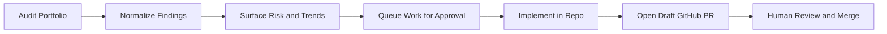

Back Office demonstrates:

- **Portfolio awareness** across many repos and departments.
- **Structured observability** through scores, backlog history, queue state, and delivery metadata.
- **Operator control** through explicit approval steps.
- **Responsible AI usage** where AI assists judgment without replacing accountability.

### What Makes It Credible

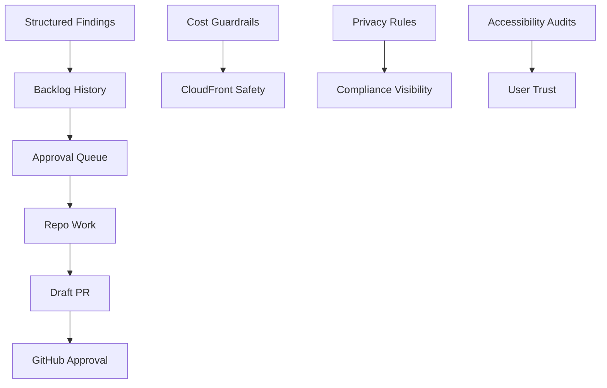

The system is credible because it combines:

- **Real artifacts**: JSON findings, queue payloads, score history, audit logs, and published dashboards.
- **Clear boundaries**: approval before execution, draft PR before merge, GitHub review before production.
- **Operational discipline**: CloudFront cost guardrails, per-product isolation, auditable status transitions.
- **Human-centered framing**: recommendations are visible and attributable, not silent background behavior.

The current code backs that story directly:

- `backoffice/workflow.py` runs audits and refreshes dashboard artifacts
- `backoffice/aggregate.py` builds department payloads and summary views
- `backoffice/backlog.py` deduplicates findings and tracks recurrence
- `backoffice/tasks.py` persists queue state and queue history
- `backoffice/server.py` exposes local operator APIs for audits and approvals
- `backoffice/sync/engine.py` publishes dashboard assets with bounded CDN invalidation

[Back to top](#table-of-contents)

---

## Operating Model

### End-to-End Flow

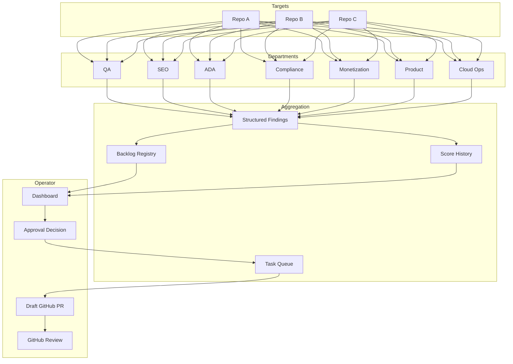

At a high level:

1. Department agents scan each configured repo.
2. Findings are normalized into a common schema.
3. The backlog records recurrence, timestamps, severity, and current state.
4. The dashboard surfaces scores, findings, and queue status.
5. A person can click a finding and queue it for approval.
6. Approved work moves into the task queue as actionable engineering work.
7. Work can progress to a draft GitHub PR that still requires GitHub approval.

The refresh path in code is concrete:

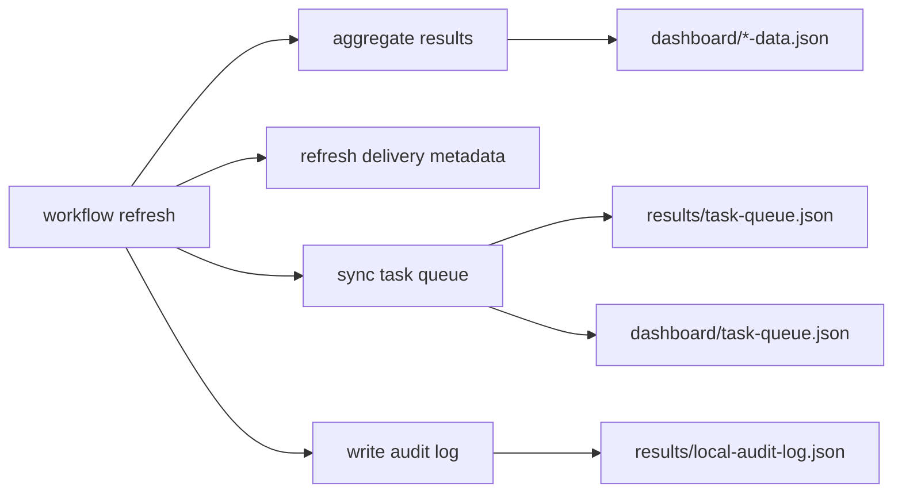

### Departments

| Department | Primary question |
|---|---|
| **QA** | What is broken, risky, slow, or fragile? |
| **SEO** | What hurts discoverability, indexability, and metadata quality? |
| **ADA** | What blocks accessibility and WCAG conformance? |
| **Compliance** | What creates privacy, legal, or policy exposure? |
| **Monetization** | What commercial opportunities are visible without degrading trust? |
| **Product** | What product gaps, workflow issues, or roadmap moves should be considered? |
| **Cloud Ops** | What infrastructure, cost, reliability, or Well-Architected issues matter now? |

### Objective vs Advisory Work

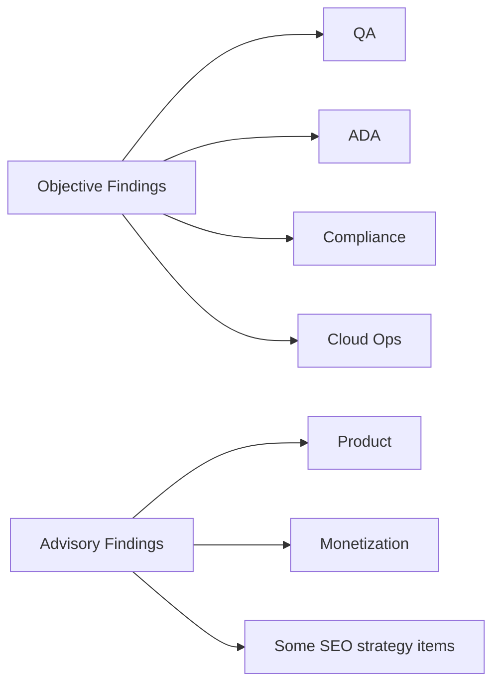

Back Office distinguishes between:

- **Objective work**: issues that can be checked against standards, tests, or concrete implementation facts.
- **Advisory work**: suggestions that still benefit from human judgment and product context.

That distinction matters in the queue:

- objective findings can move quickly into approval for remediation
- advisory findings can be queued as deliberate product decisions instead of being treated as facts

[Back to top](#table-of-contents)

---

## Dashboard

The dashboard is the product’s strongest surface. It is where observability and operator control meet.

### What The Operator Sees

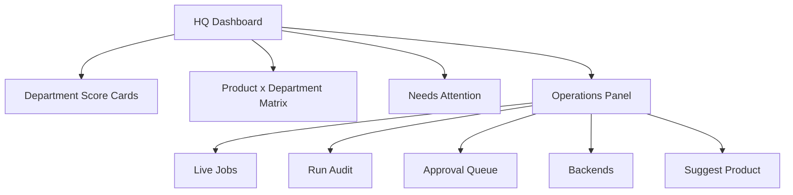

Core dashboard surfaces:

| Surface | Why it matters |
|---|---|
| **Score cards** | Show portfolio health and recent movement by department |
| **Matrix** | Lets an operator drill into one product and one discipline immediately |
| **Needs Attention** | Highlights the most important findings without asking the operator to hunt |
| **Finding detail** | Shows evidence, impact, file path, recurrence, and next action |
| **Approval Queue** | Shows what is waiting for a human decision, what is ready, and what is in GitHub review |

### How Findings Become Queue Items

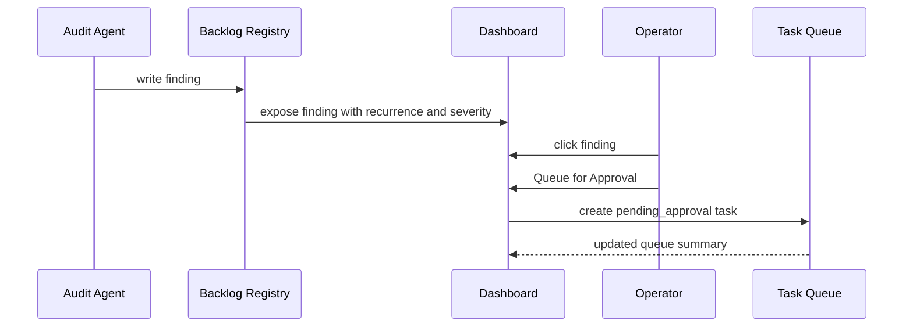

A finding detail panel shows:

- title
- severity
- repo
- department
- description
- evidence
- impact
- file and line
- recommended fix
- backlog recurrence history
- queue action for approval

That means a finding is not just a static observation. It is immediately operational.

### Approval Queue

The approval queue is where work becomes governable.

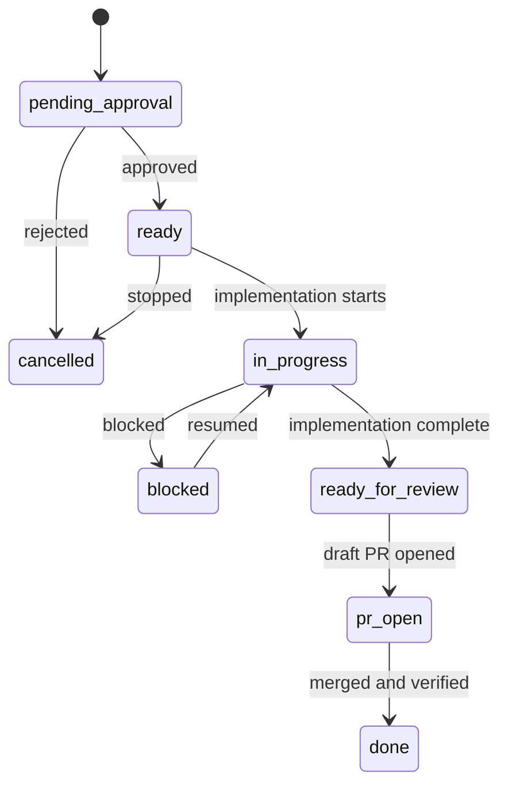

The queue is designed to answer:

- what is awaiting approval
- what has been approved but not started
- what is actively in progress
- what is blocked
- what is ready for review
- what already has a draft PR open

It also reports counts by product so backlog numbers remain isolated instead of crossing products.

Current queue states implemented in code:

- `pending_approval`
- `proposed`
- `approved`
- `ready`
- `queued`
- `in_progress`
- `blocked`
- `ready_for_review`
- `pr_open`
- `done`
- `cancelled`

### GitHub Review Path

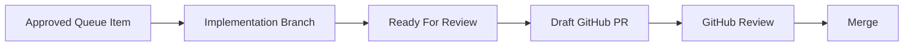

This keeps the human in the loop in two separate places:

1. **approval to do the work**
2. **approval to merge the work**

Back Office can help create the branch and draft PR context, but GitHub remains the formal review gate.

[Back to top](#table-of-contents)

---

## Quick Start

### 1. Install

```bash
git clone https://github.com/CodyJo/back-office.git
cd back-office
make setup
```

Prerequisites:

- Python 3.12+
- Git
- AWS CLI for dashboard publishing
- Claude CLI and/or Codex if you want AI-backed repo work
- GitHub CLI (`gh`) if you want draft PR creation from the approval flow

### 2. Configure Targets

```bash
cp config/backoffice.example.yaml config/backoffice.yaml
```

Two config files matter in the current code:

- `config/backoffice.yaml` for runtime config, dashboard publish targets, backend routing, and the newer target map used by server and sync code
- `config/targets.yaml` for the local audit workflow target list used by `backoffice/workflow.py`

The simplest safe approach is to keep target definitions aligned in both files.

Example target in `config/backoffice.yaml`:

```yaml
targets:
  my-app:
    path: /path/to/my-app
    language: typescript
    default_departments: [qa, seo, ada, compliance, monetization, product, cloud-ops]
    lint_command: "npm run lint"
    test_command: "npm test"
    coverage_command: "npm run test:coverage"
    deploy_command: "npm run build"
    context: |
      What the product does, who uses it, and what matters most.
```

Example target in `config/targets.yaml`:

```yaml
targets:
  - name: my-app
    path: /path/to/my-app
    language: typescript
    default_departments: [qa, seo, ada, compliance, monetization, product, cloud-ops]
    lint_command: "npm run lint"
    test_command: "npm test"
    coverage_command: "npm run test:coverage"
    deploy_command: "npm run build"
    context: |
      What the product does, who uses it, and what matters most.
```

### 3. Run Audits

```bash
make qa TARGET=/path/to/my-app
make audit-all-parallel TARGET=/path/to/my-app
python -m backoffice audit-all --targets my-app
```

### 4. Launch The Dashboard

```bash
python -m backoffice serve --port 8070
```

Then open `http://localhost:8070`.

### 5. Work The Queue

Typical operator flow:

1. Open a finding from `Needs Attention` or a department panel.
2. Review evidence, impact, and recurrence history.
3. Click `Queue for Approval`.
4. Move to the `Approval Queue` tab in Operations.
5. Approve or cancel the item.
6. After implementation, open a draft GitHub PR for formal review.

### 6. Publish Dashboard Assets

```bash
python -m backoffice sync
```

This publishes dashboard assets to configured S3 targets and performs bounded CloudFront invalidation.

[Back to top](#table-of-contents)

---

## CLI And Make Targets

### Python CLI

All commands run through:

```bash
python -m backoffice <command>
```

Key commands:

| Command | Purpose |
|---|---|
| `audit <target>` | Run audits for one configured target |
| `audit-all` | Run audits across configured targets |
| `refresh` | Regenerate dashboard artifacts from existing results |
| `sync` | Publish dashboard artifacts |
| `serve --port 8070` | Start the local dashboard server |
| `list-targets` | Show configured targets |
| `tasks list` | Show queue items |
| `tasks show --id <task-id>` | Inspect one queue item |
| `tasks create --repo <repo> --title <title>` | Create a manual queue item |
| `tasks start/block/review/complete/cancel` | Advance queue state |
| `regression` | Run the regression suite |

The CLI routing in `backoffice/__main__.py` maps:

- `audit`, `audit-all`, `refresh`, `list-targets` -> `backoffice/workflow.py`
- `tasks ...` -> `backoffice/tasks.py`
- `sync` -> `backoffice/sync/engine.py`
- `serve` -> `backoffice/server.py`

### Make Targets

Audit and dashboard workflow:

| Target | Purpose |
|---|---|
| `make qa TARGET=/path` | QA scan |
| `make seo TARGET=/path` | SEO audit |
| `make ada TARGET=/path` | Accessibility audit |
| `make compliance TARGET=/path` | Compliance audit |
| `make monetization TARGET=/path` | Monetization audit |
| `make product TARGET=/path` | Product audit |
| `make cloud-ops TARGET=/path` | Cloud Ops audit |
| `make audit-all TARGET=/path` | Run all departments sequentially |
| `make audit-all-parallel TARGET=/path` | Run all departments in parallel waves |
| `make full-scan TARGET=/path` | Audit plus fix-agent pass |
| `make local-refresh` | Rebuild dashboard artifacts from current results |
| `make dashboard` | Publish dashboards |
| `make jobs` | Start the local dashboard server |
| `make test` | Run pytest |
| `make test-coverage` | Run pytest with coverage |

### Local Server APIs

The local dashboard server exposes concrete JSON endpoints:

| Route | Method | Purpose |
|---|---|---|
| `/api/run-scan` | `POST` | Run one department against the current target repo |
| `/api/run-all` | `POST` | Run all departments against the current target repo |
| `/api/run-regression` | `POST` | Start regression runner |
| `/api/manual-item` | `POST` | Add a manual backlog item |
| `/api/ops/status` | `GET` | Fetch jobs, queue state, backend health, and targets |
| `/api/ops/backends` | `GET` | Fetch backend health and routing policy |
| `/api/ops/audit` | `POST` | Start an audit for a configured target |
| `/api/tasks` | `GET` | Fetch the queue payload |
| `/api/tasks/queue-finding` | `POST` | Queue a finding for approval |
| `/api/tasks/approve` | `POST` | Approve a queued item |
| `/api/tasks/cancel` | `POST` | Cancel a queued item |
| `/api/tasks/request-pr` | `POST` | Open a draft GitHub PR |
| `/api/ops/product/suggest` | `POST` | Submit a product suggestion |
| `/api/ops/product/approve` | `POST` | Approve a suggested product and add it to config |

[Back to top](#table-of-contents)

---

## Architecture

### System Topology

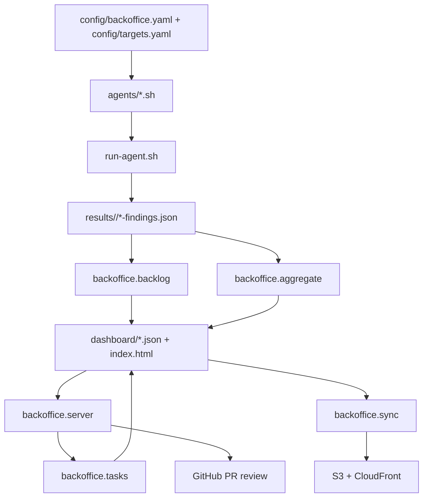

### Core Data Artifacts

| Artifact | Role |
|---|---|
| `results/<repo>/*-findings.json` | Raw department output |
| `dashboard/*-data.json` | Dashboard-ready department payloads |
| `dashboard/backlog.json` | Persistent finding registry with recurrence |
| `dashboard/score-history.json` | Trend history for sparkline rendering |
| `config/task-queue.yaml` | Source-of-truth task queue |
| `results/task-queue.json` | Machine-readable queue payload |
| `dashboard/task-queue.json` | Frontend-facing queue payload |
| `results/local-audit-log.json` | Audit log and target snapshot data |

### Key Files

| File | Purpose |
|---|---|
| `backoffice/workflow.py` | Audit orchestration and refresh flow |
| `backoffice/aggregate.py` | Findings aggregation into dashboard payloads |
| `backoffice/backlog.py` | Finding normalization and recurrence tracking |
| `backoffice/tasks.py` | Approval queue model and queue lifecycle |
| `backoffice/server.py` | Dashboard server and approval APIs |
| `backoffice/__main__.py` | CLI routing |
| `dashboard/index.html` | Main control-plane UI |
| `Makefile` | Operator shortcuts for audits, serving, sync, and tests |
| `scripts/sync-dashboard.sh` | Dashboard publishing entrypoint |
| `docs/WORKFLOW-ARCHITECTURE.md` | Detailed architecture doc |
| `docs/CICD-REFERENCE.md` | Delivery and GitHub review model |
| `docs/COST_GUARDRAILS.md` | CloudFront and AWS cost controls |

[Back to top](#table-of-contents)

---

## CI/CD

Back Office uses AWS CodeBuild for CI and CD and relies on GitHub review for pull request approval.

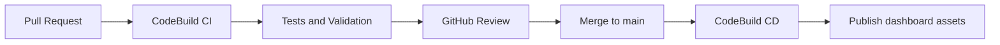

Current posture:

- pull requests run validation gates
- merges to `main` run deployment gates
- dashboard publishing is bounded and cost-aware
- draft PR creation from the dashboard still terminates in normal GitHub review

[Back to top](#table-of-contents)

---

## Governance

Back Office is governed by three non-negotiable ideas:

1. **Privacy first**
2. **Human-centered AI**
3. **Operational safety**

That means:

- AI suggestions are visible and attributable.
- People approve meaningful changes.
- GitHub remains a real review boundary.
- Accessibility and compliance findings are treated as serious operating work.
- Cost-sensitive infrastructure behavior is controlled deliberately.

See [MASTER-PROMPT.md](MASTER-PROMPT.md) for the full operating rules.

[Back to top](#table-of-contents)

---

## Docs

Core documentation:

- [Workflow Architecture](docs/WORKFLOW-ARCHITECTURE.md)
- [CI/CD Reference](docs/CICD-REFERENCE.md)
- [Cost Guardrails](docs/COST_GUARDRAILS.md)
- [Live URLs](docs/LIVE-URLS.md)

[Back to top](#table-of-contents)

---

## Handoff

Continuation notes and current implementation state live in [docs/HANDOFF.md](docs/HANDOFF.md).

[Back to top](#table-of-contents)
