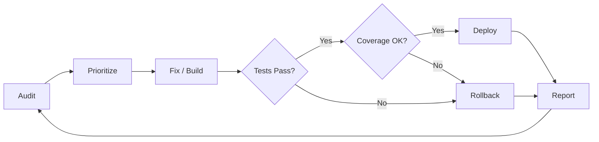
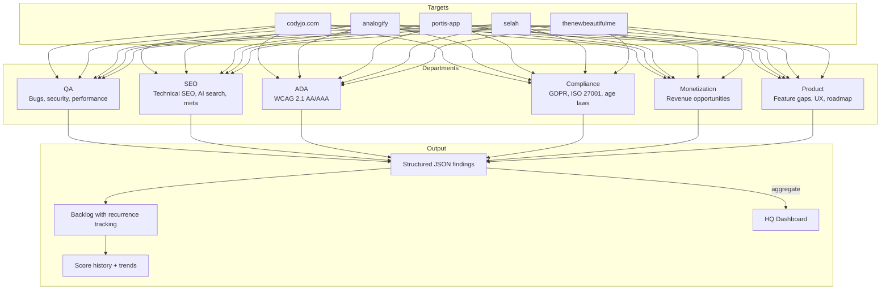
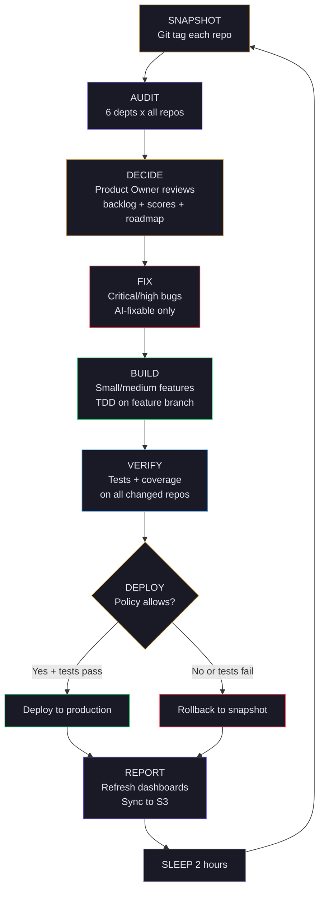
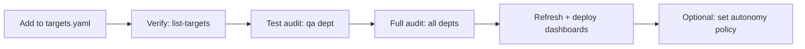
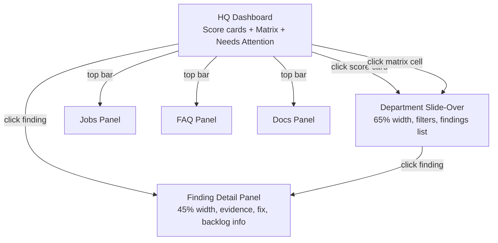
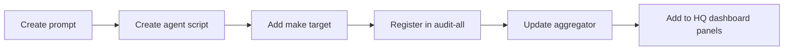

# Back Office

**Autonomous multi-repo engineering operations. Privacy-first. Human-centered. Audit, prioritize, fix, build, verify, deploy — on repeat.**

Back Office is an AI-powered operating system that runs six specialized departments against your entire portfolio of codebases. It finds bugs, checks accessibility, audits compliance, evaluates SEO, identifies revenue opportunities, and builds product roadmaps — then fixes what it can, deploys what passes, and tracks what remains across cycles.

**Built on three principles:**
- **Privacy first** — user data is minimized, encrypted, and never exploited. Privacy violations are treated as bugs, not suggestions.
- **Human-centered AI** — AI augments human judgment, never replaces it. Every AI decision is transparent, explainable, and overridable.
- **Accessible by default** — every product must work for people with disabilities. Accessibility is a core value, not a compliance checkbox.

---

## Why Back Office

### Speed with safety

Software teams face a constant tension: move fast or move carefully. Back Office eliminates this tradeoff by making every autonomous change a **two-way door**:

- Every cycle starts with a **git tag snapshot** — rollback is one command
- Every fix runs in an **isolated git worktree** — main branch stays clean until tests pass
- Every feature builds on a **separate branch** — merged only after verification
- Every deploy is **gated by tests and coverage** — if quality drops, the change is discarded
- The system **gets better over time** — each cycle adds to the test suite, expanding the safety net for future changes



### ROI per cycle

Each overnight cycle produces measurable improvements:

| What happens | Business impact |
|---|---|
| Critical bugs fixed automatically | Fewer production incidents, less firefighting |
| Accessibility gaps closed | Reduced legal risk, broader user base |
| SEO issues resolved | Better search rankings, more organic traffic |
| Compliance gaps identified | Audit readiness, reduced regulatory exposure |
| Features implemented and tested | Faster time-to-market without developer burnout |
| Findings tracked across scans | Chronic issues surface and get prioritized — nothing falls through the cracks |

The compounding effect: as Back Office adds tests with every fix and feature, the safety net grows. Cycle 10 is safer than cycle 1 because the test coverage is higher and the backlog has more history.

### The backlog never lies

Traditional project management relies on humans remembering what was flagged. Back Office uses **content-hash deduplication** to track every finding across audits:

- First seen date, last seen date, and how many audits it appeared in
- Chronic issues (appearing in 3+ audits) get automatically prioritized
- Fixed issues stop appearing; stale issues get marked as presumed fixed
- The Product Owner agent uses this history to make smarter decisions each cycle

---

## How It Works

### Six departments, one command



Each department runs an AI agent with a domain-specific system prompt against a target repository. Agents write structured JSON findings to `results/<repo>/`. Those findings are aggregated, deduplicated into a persistent backlog, and served through a consolidated dashboard.

| Department | What It Audits | Trust Level |
|---|---|---|
| **QA** | Bugs, security issues, performance problems. Fix Agent auto-remediates. | Objective |
| **SEO** | Technical SEO, AI search optimization, content SEO, social meta | Objective |
| **ADA** | WCAG 2.1 AA/AAA accessibility (Perceivable, Operable, Understandable, Robust) | Objective |
| **Compliance** | GDPR, ISO 27001, age verification laws (US state + UK Online Safety Act) | Objective |
| **Monetization** | Revenue opportunities: ads, affiliate, premium, print, digital, services | Advisory |
| **Product** | Feature gaps, UX improvements, technical debt, growth opportunities | Advisory |

> **Objective** findings are verifiable against standards and testable. **Advisory** findings are recommendations based on heuristics — useful but not authoritative.

---

## The Overnight Loop

The overnight autonomous loop is Back Office's most powerful feature. Start it before bed, wake up to a better codebase.



### How the Product Owner decides

The Product Owner is an AI agent that reads the full state of your portfolio and outputs a structured work plan:

1. **Critical/high severity fixes** with `fixable_by_agent: true` — always first
2. **Chronic issues** — findings appearing in 3+ consecutive audits
3. **Low-hanging features** — easy/moderate effort from the product roadmap
4. **Lowest-scoring repos** — target where improvement is most needed
5. **Never re-attempts** items that failed in the last 2 cycles

Maximum per cycle: **5 fixes + 2 features** (keeps cycles under 2 hours).

### Safety gates

| Gate | When | On failure |
|---|---|---|
| Git tag snapshot | Before any changes | Creates rollback point |
| Dirty worktree check | Before mutating a repo | Skips repo with warning |
| Autonomy policy | Before each fix/feature | Skips if policy disallows |
| Worktree isolation | During fixes | Discard worktree, main untouched |
| Feature branch | During builds | Branch deleted on failure |
| Test suite | After each change | Change discarded |
| Coverage check | After each change | Change discarded if coverage drops |
| Deploy policy gate | Before deploy | Skips deploy if `deploy_mode != production-allowed` |
| Failure memory | Next cycle | Doesn't re-attempt recent failures |

### Start the loop

```bash
# In tmux (recommended)
tmux new-session -d -s overnight \
  'cd /path/to/back-office && make overnight'

# With options
make overnight INTERVAL=120 TARGETS=analogify,portis-app

# Dry-run (audit + decide only, no changes)
make overnight-dry
```

### Monitor

```bash
# Watch the log
tail -f results/overnight.log

# Check current plan and history
make overnight-status

# Stop gracefully (finishes current phase)
make overnight-stop
```

### Morning review

```bash
# What happened?
make overnight-status
cat results/overnight.log | grep "CYCLE END"

# Roll back everything if needed
make overnight-rollback
```

---

## Quick Start

### 1. Clone and install

```bash
git clone <repo-url> back-office
cd back-office
make setup        # checks prerequisites, creates config
```

### 2. Configure targets

```bash
cp config/backoffice.example.yaml config/backoffice.yaml
```

Edit `config/backoffice.yaml` and add your repos:

```yaml
targets:
  my-app:
    path: /path/to/my-app
    language: typescript
    default_departments: [qa, seo, ada, compliance, monetization, product]
    lint_command: "npm run lint"
    test_command: "npm test"
    coverage_command: "npm run test:coverage"
    deploy_command: "npm run build"
    context: |
      Brief description of this project for the AI agents.
    autonomy:                          # optional — controls overnight loop behavior
      allow_fix: true                  # allow auto-fixing bugs
      allow_feature_dev: false         # allow implementing features
      allow_auto_merge: false          # allow merging feature branches
      allow_auto_deploy: false         # allow deploying to production
      deploy_mode: disabled            # disabled | manual | staging-only | production-allowed
      require_clean_worktree: true     # skip if uncommitted changes
      require_tests: true              # skip if no test suite
      max_changes_per_cycle: 3         # max fixes+features per cycle
```

### 3. Run an audit

```bash
# Single department
make qa TARGET=/path/to/my-app

# All departments (parallel)
make audit-all-parallel TARGET=/path/to/my-app

# All departments, all targets
make local-audit-all
```

### 4. View the dashboard

```bash
python -m backoffice serve --port 8070
# Open http://localhost:8070
```

The HQ dashboard shows:
- **Score cards** for each department with sparkline trends
- **Product x Department matrix** — click any cell to drill in
- **Needs Attention feed** — top findings sorted by severity and recurrence
- **Slide-over panels** — department detail, finding detail with evidence + fix suggestions

### 5. Deploy dashboards

```bash
python -m backoffice sync
```

### 6. Start the overnight loop

```bash
make overnight          # full autonomous cycle
make overnight-dry      # audit + decide only (safe preview)
```

---

## Adding a New Project

To onboard a repository into Back Office:



1. **Add target entry** to `config/backoffice.yaml` (see format above)
2. **Verify**: `python -m backoffice list-targets`
3. **Test audit**: `python -m backoffice audit my-app --departments qa`
4. **Full audit**: `python -m backoffice audit my-app`
5. **Refresh dashboards**: `python -m backoffice refresh && python -m backoffice sync`
6. **Set autonomy policy** (optional): add `autonomy:` block to enable overnight fixes/features/deploys

---

## Command Reference

### Python CLI

All commands: `python -m backoffice <command>`

| Command | Description |
|---|---|
| `audit <target> [-d dept1,dept2]` | Run audit on a configured target |
| `audit-all [--targets t1,t2] [--departments d1,d2]` | Run audits across all targets |
| `list-targets` | List configured targets |
| `refresh` | Regenerate dashboard data from existing results |
| `sync [--dept name] [--dry-run]` | Upload dashboards to S3 |
| `serve [--port 8070]` | Local dashboard server |
| `config show` | Dump resolved configuration |
| `tasks list [--repo name] [--status s]` | List tasks |
| `regression` | Run portfolio regression tests |

### Make Targets

| Target | Description |
|---|---|
| **Auditing** | |
| `make qa TARGET=/path` | QA scan |
| `make seo TARGET=/path` | SEO audit |
| `make ada TARGET=/path` | ADA compliance |
| `make compliance TARGET=/path` | Regulatory compliance |
| `make monetization TARGET=/path` | Monetization strategy |
| `make product TARGET=/path` | Product roadmap |
| `make audit-all-parallel TARGET=/path` | All 6 departments (2 parallel waves) |
| `make full-scan TARGET=/path` | All audits + auto-fix |
| **Overnight Loop** | |
| `make overnight` | Start autonomous loop |
| `make overnight-dry` | Dry-run (audit + decide only) |
| `make overnight-stop` | Graceful stop |
| `make overnight-status` | Show plan + cycle history |
| `make overnight-rollback` | Roll back all repos to last snapshot |
| **Dashboard** | |
| `make dashboard` | Deploy dashboards to S3 |
| `make jobs` | Start local dashboard server |
| **Testing** | |
| `make test` | Run pytest suite |
| `make test-coverage` | Run with coverage |
| `make regression` | Portfolio regression tests |

---

## Dashboard

The dashboard is a single HQ page with slide-over panels for each department.



### What you see

- **Top bar**: Product selector, Jobs/Docs/FAQ buttons, last scan timestamp
- **Score cards**: 6 department scores with sparkline trends (last 5 scans)
- **Product x Department matrix**: Color-coded cells, click to drill in
- **Needs Attention**: Top 15 findings by severity x recurrence x effort
- **Slide-over panels**: Consistent filter bar (severity, status, effort, AI fixable, search)
- **Finding detail**: Full description, evidence code block, impact, file path, recommended fix, AI fix command, backlog recurrence info

### Data flow

```
agents write findings → results/<repo>/<dept>-findings.json
                      ↓
python -m backoffice refresh
                      ↓
aggregator normalizes + deduplicates
                      ↓
dashboard/*-data.json  (department data)
backlog.json           (persistent finding registry)
score-history.json     (sparkline trends)
                      ↓
python -m backoffice sync → S3 → CloudFront
```

---

## Architecture

```
backoffice/               Python package
  __main__.py             CLI entry point
  config.py               Unified config (config/backoffice.yaml)
  workflow.py             Audit orchestration
  aggregate.py            Results aggregation + backlog merge
  backlog.py              Finding hash, normalize, merge, score history
  delivery.py             Delivery automation metadata
  tasks.py                Task queue
  sync/engine.py          S3 upload + CDN invalidation
  server.py               Local dashboard server

agents/                   Agent launchers (shell)
  qa-scan.sh              QA department
  seo-audit.sh            SEO department
  ada-audit.sh            ADA department
  compliance-audit.sh     Compliance department
  monetization-audit.sh   Monetization department
  product-audit.sh        Product department
  fix-bugs.sh             Fix agent (worktree isolation)
  product-owner.sh        Product Owner (overnight loop)
  feature-dev.sh          Feature dev (overnight loop)
  prompts/                System prompts for each agent

scripts/
  overnight.sh            Overnight autonomous loop orchestrator
  run-agent.sh            AI agent invocation adapter
  setup.sh                Initial setup wizard

config/                   Configuration (gitignored)
  backoffice.yaml         Unified config
  targets.yaml            Target repos + autonomy policy

dashboard/                Consolidated HQ dashboard
  index.html              Single page with slide-over panels
  backlog.json            Persistent finding registry
  score-history.json      Score trend snapshots

results/                  Agent output (gitignored)
  <repo>/                 Per-repo findings
  overnight.log           Overnight loop log
  overnight-plan.json     Latest Product Owner plan
  overnight-history.json  Cycle history (last 50)

terraform/                AWS infrastructure
tests/                    Pytest suite
```

---

## Per-Target Autonomy Policy

Control what the overnight loop can do to each repo:

```yaml
# In config/targets.yaml or config/backoffice.yaml
targets:
  production-app:
    path: /path/to/app
    autonomy:
      allow_fix: true              # auto-fix bugs (default: true)
      allow_feature_dev: true      # implement features (default: false)
      allow_auto_commit: true      # commit changes (default: true)
      allow_auto_merge: true       # merge feature branches (default: false)
      allow_auto_deploy: true      # deploy to production (default: false)
      deploy_mode: production-allowed  # disabled|manual|staging-only|production-allowed
      require_clean_worktree: true # skip if dirty (default: true)
      require_tests: true          # skip if no tests (default: true)
      max_changes_per_cycle: 5     # max fixes+features (default: 3)
```

When not specified, defaults are **conservative**: fixes allowed, everything else disabled. You opt in to autonomy per-repo as trust builds.

---

## Rollback

Every overnight cycle creates a git tag on each repo before making changes:

```bash
# See available snapshots
git tag | grep overnight-before

# Roll back one repo
cd /path/to/repo
git reset --hard overnight-before-20260322-230000

# Roll back all repos at once
make overnight-rollback

# Tags auto-prune after 7 days
```

---

## CI/CD

Fully automated via **AWS CodeBuild**.

| Pipeline | Trigger | What it does |
|---|---|---|
| `back-office-ci` | Pull request | Shell syntax, Python linting (ruff), pytest regression suite |
| `back-office-cd` | Push to `main` | Validate, test, deploy dashboards to S3/CloudFront |

Build configs: `buildspec-ci.yml` / `buildspec-cd.yml`
Infrastructure: `terraform/codebuild.tf`
Logs: CloudWatch `/codebuild/back-office`

---

## Adding a New Department



1. Create prompt: `agents/prompts/<name>-audit.md`
2. Create script: `agents/<name>-audit.sh` (follow existing pattern)
3. Add make target to `Makefile`
4. Register in `audit-all` / `audit-all-parallel` sequences
5. Add to `backoffice/aggregate.py` department list
6. Add panel template to `dashboard/index.html`
7. Add standards reference: `lib/<name>-standards.md`

---

## Governance

See `MASTER-PROMPT.md` for the full autonomy safety framework, engineering standards, and operating priorities that govern all Back Office development and autonomous operations.

Key principles:
- Autonomy is only good when observable, constrained, reversible, testable, and explainable
- Protect production first — a skipped deploy is better than a bad deploy
- Distinguish objective findings (verifiable) from advisory recommendations (heuristic)
- Fail closed on invalid data — never trust agent output without validation
- Every autonomous write preserves rollback capability
