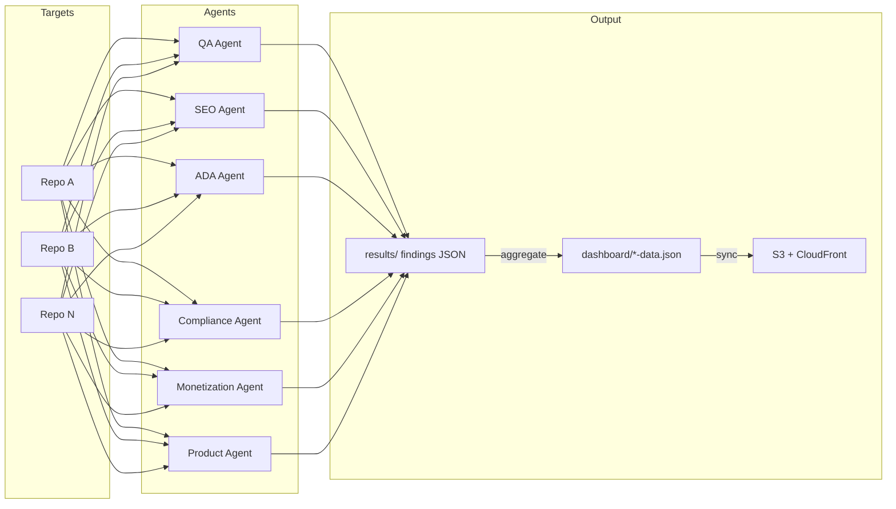
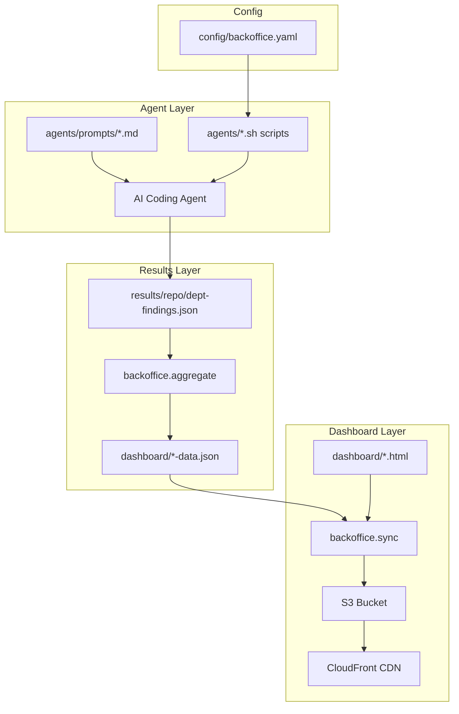

# Back Office

**A multi-department operating system of AI agents that audit, scan, and fix codebases.**

Back Office by the Cody Jo Method gives you six specialized departments -- QA, SEO, ADA Compliance, Regulatory Compliance, Monetization Strategy, and Product Roadmap -- each staffed by AI agents that produce structured findings, severity-scored and tracked through a task queue. Results feed into per-department dashboards deployed to S3/CloudFront, giving you a single pane of glass across your entire portfolio.

## How It Works

Each department runs an AI agent with a domain-specific system prompt against a target repository. Agents write structured JSON findings to `results/<repo>/`. Those findings are aggregated into dashboard data payloads, synced to S3, and served through CloudFront.

| Department | Agent | What It Audits |
|---|---|---|
| **QA** | QA Agent + Fix Agent | Bugs, security issues, performance problems. Fix Agent auto-remediates. |
| **SEO** | SEO Agent | Technical SEO, AI search optimization, content SEO, social meta |
| **ADA** | ADA Agent | WCAG 2.1 AA/AAA accessibility (Perceivable, Operable, Understandable, Robust) |
| **Compliance** | Compliance Agent | GDPR, ISO 27001, age verification laws (US state + UK Online Safety Act) |
| **Monetization** | Monetization Agent | Revenue opportunities: ads, affiliate, premium, print, digital, services, sponsorships |
| **Product** | Product Agent | Feature gaps, UX improvements, technical debt, growth opportunities, prioritized roadmap |



## Quick Start

### 1. Clone and install

```bash
git clone <repo-url> back-office
cd back-office
python -m backoffice setup          # interactive wizard -- checks prerequisites, configures runner
```

### 2. Configure targets

```bash
cp config/backoffice.example.yaml config/backoffice.yaml
# Edit config/backoffice.yaml -- add your repos under the targets: section
```

### 3. Run an audit

```bash
# Single department against a configured target
python -m backoffice audit my-project --departments qa

# All departments, all targets
python -m backoffice audit-all
```

### 4. View the dashboard locally

```bash
python -m backoffice serve --port 8070
# Open http://localhost:8070
```

### 5. Deploy dashboards to S3/CloudFront

```bash
python -m backoffice sync
```

## Command Reference

All commands are invoked via `python -m backoffice <command>`. Global flags:

| Flag | Description |
|---|---|
| `--verbose`, `-v` | Enable debug logging |
| `--json-log` | JSON-structured log output (for machine consumption) |

### Audit Workflow

| Command | Description |
|---|---|
| `audit <target> [-d dept1,dept2] [--deploy]` | Run audit on a single configured target. `--deploy` syncs dashboards after. |
| `audit-all [--departments dept1,dept2] [--targets t1,t2]` | Run audits across all (or specified) targets and departments. |
| `list-targets` | List all configured targets from `config/backoffice.yaml`. |
| `refresh` | Regenerate dashboard JSON payloads from existing `results/` data without re-running agents. |

### Dashboard and Deployment

| Command | Description |
|---|---|
| `sync [--dept <name>] [--dry-run]` | Upload dashboard HTML + data JSON to all configured S3 buckets. `--dept` limits to one department. |
| `serve [--port 8070]` | Local dev server for dashboards with scan-trigger API. |
| `api-server [--port <n>] [--bind 0.0.0.0]` | Production API server for remote scan triggers from dashboards. |

### Task Queue

| Command | Description |
|---|---|
| `tasks list [--repo <name>] [--status <s>]` | List tasks, optionally filtered by repo or status. |
| `tasks show --id <id>` | Show details for a single task. |
| `tasks create --title "..." --repo <name>` | Create a new task. |
| `tasks start --id <id>` | Mark a task as in-progress. |
| `tasks block --id <id> [--note "..."]` | Mark a task as blocked with an optional note. |
| `tasks review --id <id>` | Move a task to review status. |
| `tasks complete --id <id>` | Mark a task as complete. |
| `tasks cancel --id <id>` | Cancel a task. |
| `tasks sync` | Sync task queue data to dashboard JSON. |
| `tasks seed-etheos` | Seed the task queue from Etheos-format findings. |

### Testing and CI

| Command | Description |
|---|---|
| `regression` | Run portfolio regression tests + coverage for all configured targets. |

### Setup and Scaffolding

| Command | Description |
|---|---|
| `setup [--check-only]` | Interactive setup wizard. `--check-only` validates prerequisites without modifying anything. |
| `config show` | Dump the resolved configuration. |
| `config shell-export [--target <name>] [--fields f1 f2]` | Export config values as shell variables for use in agent scripts. |
| `scaffold --target <name> [--workflows ci,preview,cd,nightly] [--force]` | Generate GitHub Actions workflow files into a target repo. |

### Make Target Equivalents

For workflows that combine shell agent scripts with the Python CLI, `make` targets remain the primary interface:

| Make Target | Equivalent / What It Does |
|---|---|
| `make setup` | `bash scripts/setup.sh` |
| `make qa TARGET=/path` | Run QA agent scan via shell |
| `make seo TARGET=/path` | Run SEO agent audit via shell |
| `make ada TARGET=/path` | Run ADA agent audit via shell |
| `make compliance TARGET=/path` | Run Compliance agent audit via shell |
| `make monetization TARGET=/path` | Run Monetization agent audit via shell |
| `make product TARGET=/path` | Run Product agent audit via shell |
| `make fix TARGET=/path` | Run Fix agent on QA findings |
| `make watch TARGET=/path` | Continuous watch + auto-fix loop |
| `make scan-and-fix TARGET=/path` | QA scan then auto-fix |
| `make audit-all TARGET=/path` | All 6 department audits, sequential |
| `make audit-all-parallel TARGET=/path` | All 6 audits in 2 parallel waves of 3 |
| `make audit-live TARGET=/path` | All audits with live dashboard sync after each department completes |
| `make full-scan TARGET=/path` | All audits + auto-fix |
| `make local-audit TARGET_NAME=x DEPTS=qa,seo` | `python -m backoffice audit <target> -d <depts>` |
| `make local-audit-all` | `python -m backoffice audit-all` |
| `make local-targets` | `python -m backoffice list-targets` |
| `make local-refresh` | `python -m backoffice refresh` |
| `make dashboard` | `python -m backoffice sync` |
| `make quick-sync DEPT=qa` | `python -m backoffice sync --dept qa` |
| `make jobs` | `python -m backoffice serve --port 8070` |
| `make regression` | `python -m backoffice regression` |
| `make test` | `python3 -m pytest tests/ -v` |
| `make test-coverage` | `python3 -m pytest tests/ --cov=backoffice` |
| `make scaffold-workflows TARGET_NAME=x` | `python -m backoffice scaffold --target x` |
| `make cli CMD="..."` | `python -m backoffice ...` |
| `make clean` | Remove all `results/` and dashboard data JSON files |

## Dashboards

Each department has a static HTML dashboard that reads from a `<department>-data.json` file. The full set:

| File | Purpose |
|---|---|
| `dashboard/index.html` | Company HQ -- portfolio overview, links to all departments |
| `dashboard/qa.html` | QA findings, severity breakdown, fix status |
| `dashboard/seo.html` | SEO audit results and scores |
| `dashboard/ada.html` | ADA/WCAG compliance findings |
| `dashboard/compliance.html` | Regulatory compliance status |
| `dashboard/monetization.html` | Revenue opportunity analysis |
| `dashboard/product.html` | Product roadmap and backlog |
| `dashboard/jobs.html` | Real-time job progress during scans |
| `dashboard/backoffice.html` | Public-facing bug report form |

### Deployment pattern

1. Agents write findings to `results/<repo>/<department>-findings.json`
2. `python -m backoffice refresh` aggregates results into `dashboard/*-data.json`
3. `python -m backoffice sync` uploads HTML + JSON to S3 buckets configured in `config/backoffice.yaml`
4. CloudFront serves them at `backoffice.yourdomain.com`

You can configure multiple `dashboard_targets` in the config to deploy filtered views to different subdomains (e.g., one dashboard per client site).

## Configuration

All configuration lives in a single file: `config/backoffice.yaml` (gitignored -- never commit this file, it contains paths and secrets). Copy the example to get started:

```bash
cp config/backoffice.example.yaml config/backoffice.yaml
```

### runner

Defines which AI coding agent to invoke and how to parse its output.

```yaml
runner:
  command: "claude --model haiku"
  mode: "claude-print"           # claude-print | claude-json | custom
```

### api

Configuration for the local and production API servers.

```yaml
api:
  port: 8070
  api_key: ""                    # leave empty to disable auth
  allowed_origins:
    - "https://backoffice.yourdomain.com"
    - "http://localhost:8070"
```

### deploy

Where dashboards are published. Supports multiple S3 buckets with per-target repo filtering.

```yaml
deploy:
  provider: aws
  aws:
    region: us-east-1
    dashboard_targets:
      - bucket: "admin-yoursite-bucket"
        distribution_id: "XXXXXXXXXXXXXXX"
        subdomain: "backoffice.yourdomain.com"
        filter_repo: "yoursite"       # null = show all repos
        allow_public_read: false
```

### scan

Controls what the agents check and how many findings to collect.

```yaml
scan:
  run_linter: true
  run_tests: true
  security_audit: true
  performance_review: true
  code_quality: true
  min_severity: low
  max_findings: 200
  exclude_patterns:
    - "node_modules/**"
    - "venv/**"
```

### fix

Auto-fix behavior for the Fix Agent.

```yaml
fix:
  auto_fix_severity: high
  run_tests_after_fix: true
  max_parallel_fixes: 4
  auto_commit: true
  auto_push: false
```

### targets

Each key is a repo name used in CLI commands, dashboard filters, and results paths.

```yaml
targets:
  my-project:
    path: /path/to/my-project
    language: python
    default_departments: [qa, seo, ada, compliance, monetization, product]
    lint_command: "ruff check ."
    test_command: "python3 -m pytest"
    coverage_command: "python3 -m pytest --cov=. --cov-report=json:coverage.json"
    deploy_command: "bash scripts/deploy.sh"
    context: |
      Brief description of this project for the AI agent.
```

## Architecture

### Package structure

```
backoffice/               Python package -- all CLI commands
  __main__.py             CLI entry point, argparse dispatcher
  __init__.py             Package version (1.0.0)
  config.py               Loads config/backoffice.yaml into frozen dataclasses
  log_config.py           Structured logging (stderr for logs, stdout for data)
  workflow.py             Local audit orchestration (audit, audit-all, refresh, list-targets)
  aggregate.py            Aggregates results/ into dashboard *-data.json payloads
  delivery.py             Generates delivery automation metadata for dashboards
  tasks.py                Version-controlled task queue (config/task-queue.yaml)
  regression.py           Portfolio regression runner with coverage collection
  scaffolding.py          Generates GitHub Actions workflows into target repos
  setup.py                Interactive setup wizard and prerequisite checker
  server.py               Local dev server with scan-trigger API
  api_server.py           Production API server for remote scan triggers
  sync/
    engine.py             Orchestrates uploads to storage targets + CDN invalidation
    manifest.py           Tracks file hashes to skip unchanged uploads
    providers/
      base.py             Abstract storage provider interface
      aws.py              S3 + CloudFront implementation

agents/                   Shell scripts that launch AI agents with department prompts
  prompts/                System prompts for each agent type
config/                   Target configuration (gitignored)
dashboard/                Static HTML dashboards + JSON data payloads
results/                  Agent findings output (gitignored, synced to S3)
scripts/                  Legacy shell scripts (setup, sync, job-status)
terraform/                AWS infrastructure (S3 + CloudFront)
lib/                      Standards references and severity definitions
tests/                    Pytest suite
monitoring/               Grafana + Docker Compose for observability
```

### Data flow



## Adding a New Site

To onboard a new repository into the Back Office audit pipeline:

1. **Add a target entry** in `config/backoffice.yaml`:

    ```yaml
    targets:
      new-site:
        path: /path/to/new-site
        language: typescript
        default_departments: [qa, seo, ada, compliance, monetization, product]
        lint_command: "npm run lint"
        test_command: "npm test"
        coverage_command: "npm run test:coverage"
        deploy_command: "npm run build"
        context: |
          Description of the site for agents.
    ```

2. **Verify the target is visible**:

    ```bash
    python -m backoffice list-targets
    ```

3. **Run a single-department test audit**:

    ```bash
    python -m backoffice audit new-site --departments qa
    ```

4. **Run the full audit**:

    ```bash
    python -m backoffice audit new-site
    ```

5. **Refresh and deploy dashboards**:

    ```bash
    python -m backoffice refresh
    python -m backoffice sync
    ```

6. **(Optional) Scaffold CI workflows** into the target repo:

    ```bash
    python -m backoffice scaffold --target new-site --workflows ci,preview,cd,nightly
    ```

## Adding a New Department

To add a new audit department to the Back Office:

1. **Create the agent prompt** at `agents/prompts/<name>-audit.md`. Define the audit scope, output format, and severity rubric. Follow the pattern of existing prompts.

2. **Create the agent script** at `agents/<name>-audit.sh`. Copy an existing audit script (e.g., `agents/seo-audit.sh`) and update the prompt path and department name.

3. **Create the dashboard** at `dashboard/<name>.html`. Build from an existing department dashboard template. The page should read from `<name>-data.json`.

4. **Add standards references** at `lib/<name>-standards.md` with the domain knowledge the agent needs.

5. **Add a make target** to the `Makefile`:

    ```makefile
    <name>: ## Run <name> audit on TARGET repo
    	@test -n "$(TARGET)" || (echo "Usage: make <name> TARGET=/path/to/repo" && exit 1)
    	bash agents/<name>-audit.sh "$(TARGET)"
    ```

6. **Register the department** in the audit-all sequences in the `Makefile` (both sequential and parallel variants).

7. **Update the HQ dashboard** in `dashboard/index.html` to include a card for the new department.

8. **Update aggregation** so that `backoffice/aggregate.py` picks up the new department's findings pattern.
