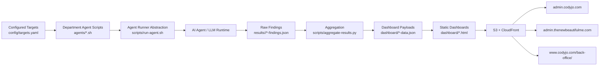
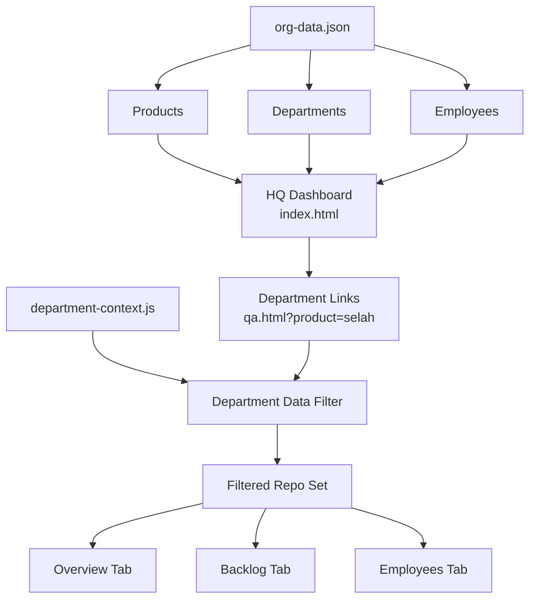
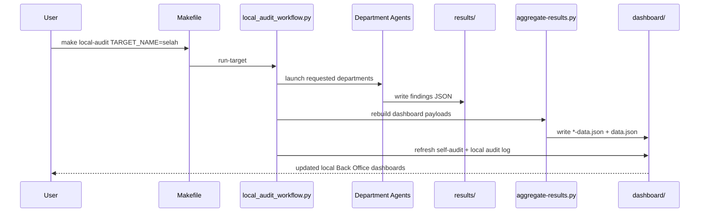

# Back Office

Back Office is Cody Jo Method's agent-agnostic internal operating system for product audits, department dashboards, and repo-to-dashboard reporting. It runs audit agents across multiple departments, normalizes their findings, and publishes static dashboards that can be filtered by product instead of by random repo.

The system is designed to work in two modes:

- local operating mode for running audits across repos in the workspace
- published dashboard mode for serving product dashboards on `admin.*` subdomains and `www.codyjo.com/back-office/`

## Documentation Map

GitHub-facing reference docs:

- [Workflow Architecture](docs/WORKFLOW-ARCHITECTURE.md)
- [CLI Reference](docs/CLI-REFERENCE.md)
- [CI/CD Reference](docs/CICD-REFERENCE.md)
- [Live URLs](docs/LIVE-URLS.md)

Published dashboard docs:

- `dashboard/documentation.html`
- `dashboard/documentation-github.html`
- `dashboard/documentation-cicd.html`
- `dashboard/documentation-cli.html`
- `dashboard/metrics.html`

## What Back Office Does

Back Office provides:

- department audits for `qa`, `seo`, `ada`, `compliance`, `privacy`, `monetization`, and `product`
- a product-first HQ dashboard that rolls those departments up by product
- per-department dashboards with backlog, ratings, status buckets, and employee/agent coverage
- local audit orchestration for one repo or many repos
- deploy/sync tooling for publishing static dashboards and JSON payloads to S3 + CloudFront
- an agent runner abstraction so the system is not tied to one model vendor

## Core Concepts

### Product-first reporting

The main HQ view is not a repo browser. It is a portfolio dashboard that answers:

- which products are being reported on
- which departments have signals for that product
- what backlog exists by department
- what is fixed, in progress, or still open
- which employees or AI agents are assigned to each lane

### Department-first execution

Each audit department produces its own findings and score model:

- QA: bugs, regression risk, test posture, fixability
- SEO: search/discoverability structure and metadata
- ADA: WCAG/accessibility problems and compliance posture
- Compliance: regulatory and operational compliance issues
- Privacy: trust, data handling, and exposure issues
- Monetization: offer, conversion, pricing, and revenue opportunities
- Product: feature gaps, UX issues, roadmap candidates, and readiness

### Static dashboard architecture

The dashboards are static HTML + JavaScript. There is no frontend build step. Findings are emitted as JSON, aggregated into dashboard data files, then published directly to S3.

## Architecture

### Runtime Architecture



### Product Filtering Model



### Local Audit Workflow



## Repository Layout

```text
back-office/
├── agents/
│   ├── qa-scan.sh
│   ├── seo-audit.sh
│   ├── ada-audit.sh
│   ├── compliance-audit.sh
│   ├── monetization-audit.sh
│   ├── product-audit.sh
│   ├── fix-bugs.sh
│   ├── watch.sh
│   └── prompts/
├── config/
│   ├── qa-config.yaml
│   ├── qa-config.example.yaml
│   ├── targets.yaml
│   └── targets.example.yaml
├── dashboard/
│   ├── index.html
│   ├── admin.html
│   ├── qa.html
│   ├── seo.html
│   ├── ada.html
│   ├── compliance.html
│   ├── privacy.html
│   ├── monetization.html
│   ├── product.html
│   ├── jobs.html
│   ├── self-audit.html
│   ├── backoffice.html
│   ├── automation-data.json
│   ├── department-context.js
│   ├── site-branding.js
│   └── *-data.json
├── results/
├── scripts/
│   ├── aggregate-results.py
│   ├── generate-delivery-data.py
│   ├── local_audit_workflow.py
│   ├── scaffold-github-workflows.py
│   ├── sync-dashboard.sh
│   ├── quick-sync.sh
│   ├── dashboard-server.py
│   ├── api-server.py
│   ├── run-agent.sh
│   ├── job-status.sh
│   ├── setup.sh
│   ├── test-scoring.py
│   └── test-local-audit-workflow.py
├── templates/
│   └── github-actions/
├── terraform/
├── Makefile
└── README.md
```

## How the System Works

### 1. Configure targets

`config/targets.yaml` defines the repos that can be audited locally. Each target can include:

- repo name
- absolute path
- language/runtime hints
- default departments
- lint/test/deploy commands
- product context for the agents

### 2. Run audits

Department scripts in `agents/` call `scripts/run-agent.sh`, which is the runner abstraction layer. That script is where the actual agent implementation is selected.

This is what makes Back Office AI-agnostic: the dashboards and orchestration do not care which compatible coding agent sits behind the runner layer, as long as it can execute the prompt contract and return the expected findings.

### 3. Write findings

Each audit writes structured results into `results/<repo>/`. Common files include:

- `findings.json`
- `seo-findings.json`
- `ada-findings.json`
- `compliance-findings.json`
- `privacy-findings.json`
- `monetization-findings.json`
- `product-findings.json`

### 4. Aggregate for dashboard use

`scripts/aggregate-results.py` converts raw findings into dashboard payloads in `dashboard/`, such as:

- `data.json`
- `qa-data.json`
- `seo-data.json`
- `ada-data.json`
- `compliance-data.json`
- `privacy-data.json`
- `monetization-data.json`
- `product-data.json`
- `self-audit-data.json`
- `automation-data.json`

### 5. Publish dashboards

`scripts/sync-dashboard.sh` uploads the static HTML, JS, and JSON payloads to each configured deployment target and invalidates CloudFront.

### 6. Generate delivery automation metadata

`scripts/generate-delivery-data.py` inspects configured target repos and writes `dashboard/automation-data.json`, which the HQ dashboard uses to report:

- CI workflow coverage
- preview/staging workflow coverage
- production deploy workflow coverage
- nightly automation coverage
- delivery readiness by repo
- safe overnight candidates
- sprint buckets derived from current findings

## Dashboard Surfaces

### HQ

`dashboard/index.html`

The HQ view is the whole-estate product dashboard. It provides:

- product selector
- department cards
- recent findings
- employee roster
- product lead acceptance view
- assignments / sprint shaping
- fixed items

### Department dashboards

Department pages such as `qa.html`, `seo.html`, and `product.html` show the detailed lane view for one department. Each page now includes:

- `Overview` tab
- `Backlog` tab
- `Employees` tab
- original categorized findings and department-specific status tables below

The shared behavior for those pages lives in `dashboard/department-context.js`.

### Admin surface

`dashboard/admin.html`

This is the whole-estate admin landing surface. It uses the same portfolio data model as HQ and acts as the formal entry point for Back Office operations.

### Public back-office pages

`www.codyjo.com/back-office/` is the public-facing published copy of the Back Office dashboard set.

## Configuration

### `config/qa-config.yaml`

This file controls deployment targets and audit behavior.

Important sections:

- `aws.region`
- `dashboard_targets`
- `scan`
- `fix`
- `notifications`

Current deployment targets support:

- site-specific admin subdomains with repo-scoped data
- whole-estate admin and public back-office endpoints with aggregated data

Example:

```yaml
dashboard_targets:
  - bucket: "admin-thenewbeautifulme-site"
    base_path: ""
    cloudfront_id: "E372ZR95FXKVT5"
    subdomain: "admin.thenewbeautifulme.com"
    repo: "thenewbeautifulme"

  - bucket: "admin-codyjo-site"
    base_path: ""
    cloudfront_id: "E30Z8D5XMDR1A9"
    subdomain: "admin.codyjo.com"
    repo: ""

  - bucket: "www.codyjo.com"
    base_path: "back-office"
    cloudfront_id: "EF4U8A7W3OH5K"
    subdomain: "www.codyjo.com"
    repo: ""
```

### `config/targets.yaml`

This file defines local audit targets. Use it when you want Back Office to run against multiple repos in the workspace without hand-typing repo paths every time.

## Commands

### Setup

```bash
make setup
```

Bootstraps the project and checks local prerequisites.

### Department audits

```bash
make qa TARGET=/abs/path/to/repo
make seo TARGET=/abs/path/to/repo
make ada TARGET=/abs/path/to/repo
make compliance TARGET=/abs/path/to/repo
make monetization TARGET=/abs/path/to/repo
make product TARGET=/abs/path/to/repo
```

### Fixing and watch mode

```bash
make fix TARGET=/abs/path/to/repo
make watch TARGET=/abs/path/to/repo
make scan-and-fix TARGET=/abs/path/to/repo
```

### Company-wide audits

```bash
make audit-all TARGET=/abs/path/to/repo
make audit-all-parallel TARGET=/abs/path/to/repo
make audit-live TARGET=/abs/path/to/repo
make full-scan TARGET=/abs/path/to/repo
```

### Local workspace operations

```bash
make local-targets
make local-refresh
make local-audit TARGET_NAME=selah
make local-audit TARGET_NAME=selah DEPTS=product,qa
make local-audit-all
make self-audit-local
```

### Dashboard and local UI

```bash
make dashboard
make jobs
make scaffold-workflows TARGET_NAME=bible-app
```

`make jobs` starts the local dashboard server so you can browse `jobs.html` and trigger scans locally.
`make scaffold-workflows` writes GitHub Actions starter workflows into a configured target repo using its lint, test, and build commands from `config/targets.yaml`.

### Validation

```bash
make test
```

This runs:

- scoring tests
- local audit workflow tests

## Local Operating Flows

### Run one repo through one department

```bash
make product TARGET=/home/merm/projects/bible-app
```

### Run one configured target through a selected set of departments

```bash
make local-audit TARGET_NAME=bible-app DEPTS=product,qa,seo
```

### Refresh the dashboards from current results without rerunning agents

```bash
make local-refresh
```

### Run a whole-estate audit view locally

```bash
make local-audit-all
```

## Deployment Model

Back Office has two deployment paths:

### Repo deploy path

Push to `main` in the Back Office repo. GitHub Actions runs the dashboard deploy workflow.

### Direct sync path

Run:

```bash
bash scripts/sync-dashboard.sh
```

This:

1. runs scoring tests
2. aggregates results
3. uploads dashboard HTML/JS/assets
4. uploads the correct data payloads for each target
5. invalidates CloudFront

`scripts/quick-sync.sh` exists for fast per-department/per-repo updates during active audit sessions.

## Agent-Agnostic Runner Layer

The runner abstraction lives in:

- `scripts/run-agent.sh`

The rest of the system should treat that script as the contract boundary. To adapt Back Office to a different coding agent, update the runner layer instead of rewriting the dashboard or orchestration stack.

That contract currently expects the runner to:

- receive a prompt and repo context
- run with the allowed tool boundary for the target task
- write findings in the expected department schema

## Data Files and Ownership

### Source of truth files

- `results/<repo>/*.json`
- `dashboard/org-data.json`
- `config/targets.yaml`
- `config/qa-config.yaml`

### Generated files

- `dashboard/data.json`
- `dashboard/*-data.json`
- `dashboard/self-audit-data.json`
- `dashboard/automation-data.json`
- `dashboard/.jobs.json`
- `dashboard/.jobs-history.json`
- `dashboard/local-audit-log.json`
- `dashboard/local-audit-log.md`

Generated files should usually be treated as outputs, except when intentionally snapshotting current dashboard data into the repo.

## Testing and Safety

Before publishing, run:

```bash
make test
bash -n scripts/sync-dashboard.sh
```

If you are changing dashboard JavaScript, also validate syntax with:

```bash
node --check dashboard/department-context.js
```

## Typical Workflows

### Add a new product to HQ

1. Update `dashboard/org-data.json`
2. Add product wrappers if needed in `dashboard/`
3. Ensure target repos are represented in `config/targets.yaml`
4. Run `make local-refresh` or a local audit
5. Deploy with `make dashboard` or `bash scripts/sync-dashboard.sh`

### Scaffold safe GitHub Actions into a product repo

1. Verify the target has correct `lint_command`, `test_command`, and `deploy_command` in `config/targets.yaml`
2. Run `make scaffold-workflows TARGET_NAME=<target>`
3. Review the generated workflows in the target repo
4. Wire the preview and production deploy steps to the repo's real infrastructure
5. Push those workflow files in the target repo and let Back Office start reporting the new automation coverage

### Add a new department

1. Create `agents/<department>-audit.sh`
2. Add a prompt file under `agents/prompts/`
3. Extend result aggregation in `scripts/aggregate-results.py`
4. Create `dashboard/<department>.html`
5. Add the department to `dashboard/org-data.json`
6. Update `dashboard/index.html`
7. Update `Makefile`
8. Update `scripts/sync-dashboard.sh`
9. Add regression coverage in `scripts/test-scoring.py`

### Run Selah as the first populated product

1. Ensure `bible-app` findings exist under `results/bible-app/`
2. Run the relevant local audits
3. Refresh dashboard payloads
4. Open HQ and choose `Selah`
5. Verify department pages with `?product=selah`

## Live Endpoints

Examples of published endpoints:

- `https://admin.codyjo.com/`
- `https://admin.codyjo.com/qa.html?product=selah`
- `https://admin.thenewbeautifulme.com/`
- `https://www.codyjo.com/back-office/`
- `https://www.codyjo.com/back-office/product.html?product=selah`

## Notes

- The repo still contains some historical naming in older internal files such as `CLAUDE.md`, but the operating model and dashboard layer are now agent-agnostic.
- The dashboard set is intentionally static so it can be deployed with very little operational surface area.
- Product and employee metadata are editorial data in `dashboard/org-data.json`; findings are operational data in `results/` and generated dashboard payloads.

## License

MIT
