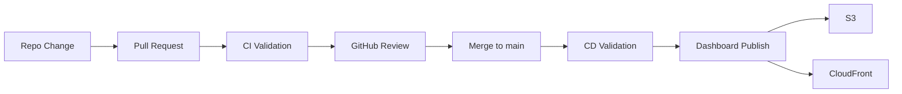
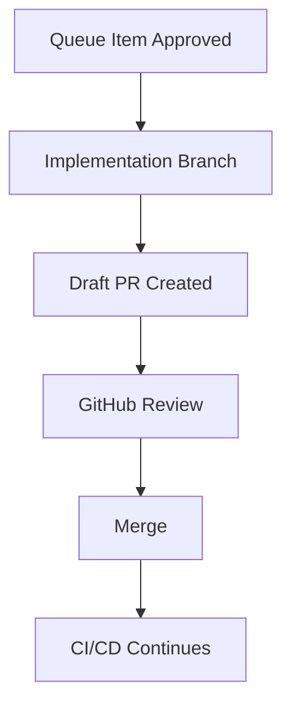
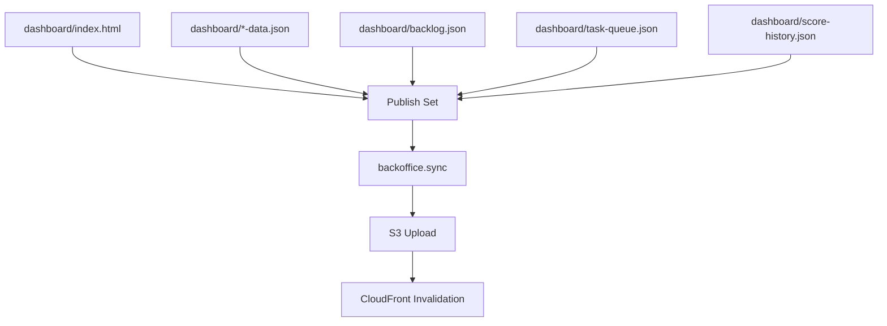
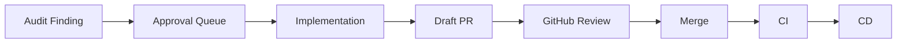

# Back Office CI/CD Reference

Back Office uses CI/CD to validate the control plane and publish dashboard assets, but the human decision model continues through GitHub review and queue approval.

This document explains how delivery works and how it supports the broader operator story.

---

## Table of Contents

- [Delivery Principles](#delivery-principles)
- [Back Office Delivery Flow](#back-office-delivery-flow)
- [GitHub Review Relationship](#github-review-relationship)
- [Pipeline Roles](#pipeline-roles)
  - [CI](#ci)
  - [CD](#cd)
- [Dashboard Publish Path](#dashboard-publish-path)
- [Approval Queue Relationship To CI/CD](#approval-queue-relationship-to-cicd)
- [Guardrails](#guardrails)
- [Relevant Files](#relevant-files)

---

## Delivery Principles

Back Office delivery follows four rules:

1. **validate before publish**
2. **publish bounded assets safely**
3. **keep GitHub review as a formal boundary**
4. **avoid hidden operational cost**

CI/CD is therefore not the whole operating model. It is one part of a larger control plane that also includes the dashboard, the approval queue, and GitHub PR review.

---

## Back Office Delivery Flow

This gives two distinct protections:

- code must pass validation
- merged changes still publish through a bounded delivery path

---

## GitHub Review Relationship

Back Office can create draft PRs from approved queue items, but GitHub remains the formal review system.

This is important for the product message:

- the dashboard provides control and visibility
- GitHub provides the canonical review and merge workflow

That separation helps the platform present well to technically mature teams because it augments established engineering controls instead of replacing them.

---

## Pipeline Roles

### CI

CI exists to validate changes before they are merged.

Expected responsibilities:

- shell validation
- Python validation
- linting
- pytest regression coverage
- confidence that control-plane changes did not break queueing, dashboard data, or sync behavior

### CD

CD exists to publish dashboard assets after merge.

Expected responsibilities:

- rerun essential validation
- publish dashboard content
- invalidate CloudFront safely
- fail closed if publish behavior becomes unexpectedly broad

---

## Dashboard Publish Path

Publishing includes:

- the main dashboard HTML
- department payloads
- backlog payload
- task queue payload
- trend and support artifacts

This matters because the dashboard is not static marketing content. It is a live operating surface whose data must stay coherent with queue and audit state.

---

## Approval Queue Relationship To CI/CD

CI/CD and the approval queue solve different parts of the system.

The queue governs *whether* work is approved to move.

CI/CD governs *whether* merged code is valid and publishable.

That distinction keeps the system easy to reason about:

- the dashboard is the control plane for prioritization and approval
- GitHub is the review plane for code changes
- CI/CD is the validation and publish plane

---

## Guardrails

Important delivery guardrails:

- dashboard publishing is centralized through sync helpers
- CloudFront invalidation is bounded, not path-explosive
- delivery roles are scoped
- merge to `main` remains the trigger for production-oriented publish behavior
- draft PR creation does not bypass GitHub approval

Cost and infrastructure guardrails are documented separately in [docs/COST_GUARDRAILS.md](./COST_GUARDRAILS.md).

---

## Relevant Files

- `buildspec-ci.yml`
- `buildspec-cd.yml`
- `backoffice/sync/engine.py`
- `backoffice/sync/providers/aws.py`
- `dashboard/index.html`
- `dashboard/task-queue.json`
- `docs/COST_GUARDRAILS.md`

