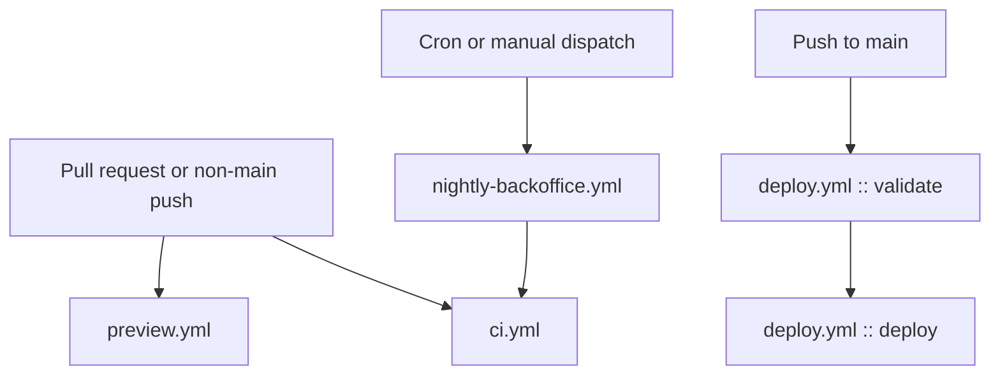
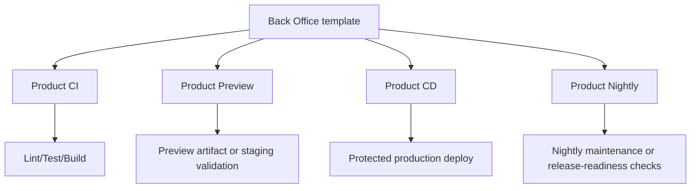

# Back Office CI/CD Reference

This is the current delivery model for Back Office and the workflow standard it scaffolds into product repos.

## Back Office Workflow Set

Back Office currently ships four workflow classes:

- `ci.yml`
- `preview.yml`
- `deploy.yml`
- `nightly-backoffice.yml`

## Back Office CI/CD Flow

## What Each Workflow Does

### `ci.yml`

Purpose: validate Back Office changes before they reach production.

Current gates:

- shell syntax validation
- Python bytecode validation
- Ruff lint
- Back Office regression suite via `make test`

### `preview.yml`

Purpose: build a review artifact for PRs.

Current behavior:

- checks out the repo
- installs Python tooling
- generates current dashboard artifacts
- uploads the dashboard directory as a GitHub artifact

### `deploy.yml`

Purpose: publish dashboard assets to production.

Current behavior:

1. Run the same validation gates as CI.
2. Configure AWS credentials from GitHub OIDC.
3. Run `bash scripts/sync-dashboard.sh`.

That means deploys are gated by:

- shell syntax
- Python syntax
- lint
- Back Office regression tests

And production publishes now include:

- the docs hub and reference pages
- the metrics dashboard at `metrics.html`

### `nightly-backoffice.yml`

Purpose: refresh delivery metadata and nightly dashboard artifacts.

Current behavior:

1. Reuse the CI workflow.
2. Run `python3 scripts/generate-delivery-data.py`.
3. Upload nightly dashboard artifacts.

## Product Repo Standard

Back Office scaffolds four workflow types into product repos:

## Required Guardrails

Every product repo should keep these guardrails:

- CI on pull requests and non-main pushes
- preview validation before merge
- production deploy only from `main`
- smoke testing after deploy
- nightly automation for release-readiness or maintenance
- protected production environments where appropriate

## Back Office Reporting Expectations

Back Office should be able to report for each target:

- whether CI exists
- whether preview exists
- whether production deploy exists
- whether nightly exists
- whether lint/test/build are configured in `config/targets.yaml`

## Security Notes

Current production posture for Back Office dashboard publishing:

- `admin.*` domains are the intended dashboard surfaces
- public non-admin targets are skipped unless `allow_public_read: true` is explicitly set
- `deploy.yml` validates before publish

## Related Files

- `.github/workflows/ci.yml`
- `.github/workflows/preview.yml`
- `.github/workflows/deploy.yml`
- `.github/workflows/nightly-backoffice.yml`
- `dashboard/metrics.html`
- `templates/github-actions/product-ci.yml`
- `templates/github-actions/product-preview.yml`
- `templates/github-actions/product-cd.yml`
- `templates/github-actions/nightly-backoffice.yml`
