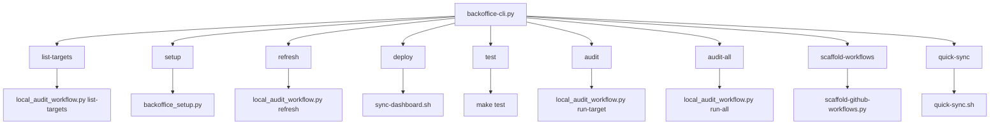

# Back Office CLI Reference

The CLI is the stable operator surface for Back Office.

Use it when you want one documented entry point instead of bouncing between Make targets and low-level scripts.

## Primary Command Surface

```bash
python3 scripts/backoffice-cli.py setup --write-missing-configs
python3 scripts/backoffice-cli.py list-targets
python3 scripts/backoffice-cli.py refresh
python3 scripts/backoffice-cli.py deploy
python3 scripts/backoffice-cli.py test
python3 scripts/backoffice-cli.py audit --target bible-app --departments qa,product
python3 scripts/backoffice-cli.py audit-all
python3 scripts/backoffice-cli.py audit-all --targets bible-app,thenewbeautifulme --departments qa,product
python3 scripts/backoffice-cli.py scaffold-workflows --target bible-app
python3 scripts/backoffice-cli.py quick-sync --department product --repo bible-app
```

## Command Map



## What Each Command Actually Does

### `setup`

Inspects the current operator environment and can create missing config files from the shipped examples.

Example:

```bash
python3 scripts/backoffice-cli.py setup --write-missing-configs
```

It reports:

- detected agent CLIs
- active `BACK_OFFICE_AGENT_RUNNER` and `BACK_OFFICE_AGENT_MODE`
- available agent scripts and prompt files
- current config file status
- recent local agent usage from `local-audit-log.json`

### `list-targets`

Shows the configured targets from `config/targets.yaml`.

Use it to confirm:

- target names
- repo paths
- the exact name you should pass to `audit` or `scaffold-workflows`

### `refresh`

Rebuilds dashboard artifacts from current result files without rerunning audits.

Use it when:

- findings already exist
- you changed aggregation logic
- you want to refresh `automation-data.json` and the local audit log

### `deploy`

Runs `bash scripts/sync-dashboard.sh`.

Use it when:

- you intentionally want to publish dashboard assets from your operator environment
- GitHub Actions is not the path you want for that exact publish

### `test`

Runs `make test`, which currently includes:

- scoring tests
- local audit workflow tests

### `audit`

Runs one configured target through the selected departments.

Example:

```bash
python3 scripts/backoffice-cli.py audit --target back-office --departments qa,product
```

If `--departments` is omitted, the target's `default_departments` are used.

### `audit-all`

Runs multiple configured targets through selected departments.

Example:

```bash
python3 scripts/backoffice-cli.py audit-all --targets bible-app,thenewbeautifulme --departments qa,product
```

If `--targets` is omitted, all configured targets run.

Exact command for every configured target:

```bash
python3 scripts/backoffice-cli.py audit-all
```

### `scaffold-workflows`

Writes GitHub Actions starter workflows into a target repo.

Example:

```bash
python3 scripts/backoffice-cli.py scaffold-workflows --target bible-app
```

Use it when:

- onboarding a new repo to Back Office reporting
- upgrading the standard workflow set for a product repo

### `quick-sync`

Publishes one department's dashboard data for one repo-scoped target.

Example:

```bash
python3 scripts/backoffice-cli.py quick-sync --department product --repo bible-app
```

Use it when you want a fast partial dashboard update instead of a full dashboard publish.

## Recommended Usage Patterns

### Rebuild and inspect

```bash
python3 scripts/backoffice-cli.py setup --write-missing-configs
python3 scripts/backoffice-cli.py audit-all
python3 scripts/backoffice-cli.py refresh
python3 scripts/backoffice-cli.py test
```

### Audit one product lane

```bash
python3 scripts/backoffice-cli.py audit --target selah --departments qa,product
python3 scripts/backoffice-cli.py refresh
```

### Roll out GitHub Actions to a new repo

```bash
python3 scripts/backoffice-cli.py list-targets
python3 scripts/backoffice-cli.py scaffold-workflows --target photo-gallery
```

## CLI vs Make

Use the CLI when:

- you want one documented operator surface
- you are writing docs and runbooks
- you want commands that map directly to named workflows

Use Make when:

- you want short aliases inside the Back Office repo
- you are manually running one lower-level department script flow

## Related Files

- `scripts/backoffice-cli.py`
- `scripts/backoffice_setup.py`
- `scripts/local_audit_workflow.py`
- `scripts/scaffold-github-workflows.py`
- `scripts/sync-dashboard.sh`
- `scripts/quick-sync.sh`
- `Makefile`
