# Back Office Workflow Architecture

Back Office is a control plane for portfolio-level engineering operations. It combines audit execution, backlog normalization, dashboard visibility, approval workflow, and GitHub-reviewed delivery into one operating model.

This document explains the architecture in depth, with emphasis on observability, queue governance, and human-centered decision flow.

---

## Table of Contents

- [System Intent](#system-intent)
- [Top-Level Topology](#top-level-topology)
- [Execution Layers](#execution-layers)
  - [1. Configuration Layer](#1-configuration-layer)
  - [2. Audit Execution Layer](#2-audit-execution-layer)
  - [3. Aggregation Layer](#3-aggregation-layer)
  - [4. Backlog Layer](#4-backlog-layer)
  - [5. Queue Layer](#5-queue-layer)
  - [6. Dashboard Layer](#6-dashboard-layer)
  - [7. Delivery Layer](#7-delivery-layer)
- [Finding Lifecycle](#finding-lifecycle)
- [Approval Lifecycle](#approval-lifecycle)
- [Product Suggestion Flow](#product-suggestion-flow)
- [GitHub Review Flow](#github-review-flow)
- [Data Contracts](#data-contracts)
- [Operational Characteristics](#operational-characteristics)
- [Relevant Files](#relevant-files)

---

## System Intent

Back Office exists to make repo operations legible and governable across a portfolio.

It is responsible for:

1. **Scanning** repos through distinct audit departments.
2. **Normalizing** findings into a common data shape.
3. **Tracking** backlog history across audit runs.
4. **Surfacing** risk, trends, and queue state in one dashboard.
5. **Routing** work into human approval instead of silent execution.
6. **Bridging** approved work to GitHub pull requests for formal review.

The architecture is intentionally biased toward:

- visible state
- structured artifacts
- explicit boundaries
- per-product isolation
- conservative delivery behavior

---

## Top-Level Topology

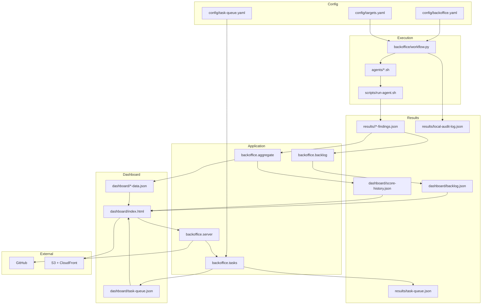

---

## Execution Layers

### 1. Configuration Layer

There are three primary sources of truth:

| File | Role |
|---|---|
| `config/backoffice.yaml` | Back Office runtime configuration, sync, routing, and target definitions in the newer config path |
| `config/targets.yaml` | Local target metadata used by workflow and dashboard operations |
| `config/task-queue.yaml` | Version-controlled queue state |

These files define:

- which repos exist
- how they are grouped
- what commands they support
- what departments run by default
- what queue items exist
- what delivery infrastructure is available

Important current nuance from the code:

- `backoffice/workflow.py` reads `config/targets.yaml`
- `backoffice.server`, `backoffice.sync`, and backend routing load `config/backoffice.yaml`
- `backoffice.tasks` persists queue state in `config/task-queue.yaml`

So the system is converging toward unified config, but local audit orchestration and dashboard/server runtime still use different config entrypoints today.

### 2. Audit Execution Layer

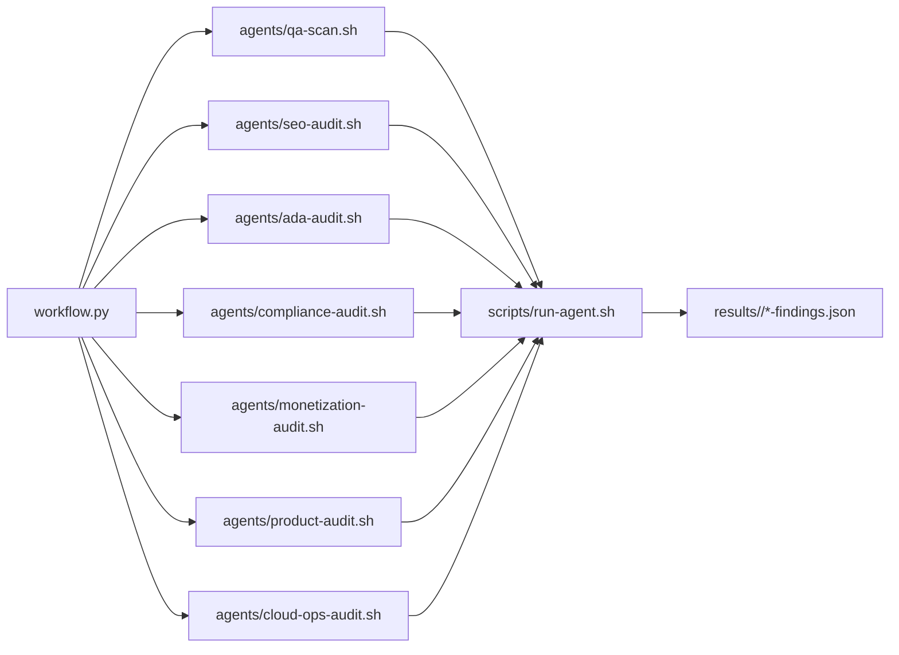

Each department stays separate on purpose.

That separation gives Back Office:

- distinct prompts
- distinct severity models
- clear ownership lanes
- easier troubleshooting
- clearer presentation in the dashboard

The execution path is:

1. `backoffice/workflow.py` resolves targets and departments.
2. It invokes department launcher scripts.
3. Launchers call `scripts/run-agent.sh`.
4. Agents produce JSON findings under `results/<repo>/`.

Current workflow commands implemented in code:

- `list-targets`
- `refresh`
- `run-target`
- `run-all`

The top-level CLI maps `audit` to `run-target` and `audit-all` to `run-all`.

### 3. Aggregation Layer

The aggregation layer converts raw outputs into dashboard-ready portfolio views.

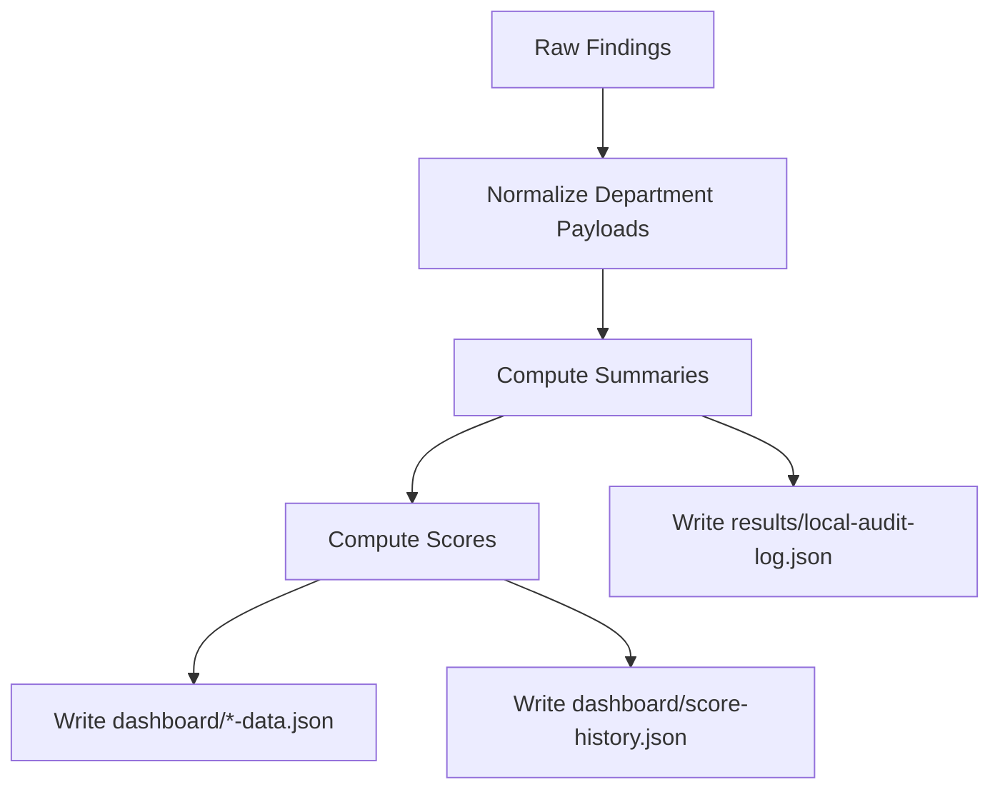

This layer produces:

- department-specific dashboard payloads
- score history for trends
- audit log data for recent execution visibility

The refresh path in `workflow.py` is explicit:

1. run `backoffice.aggregate`
2. run `backoffice.delivery`
3. sync the task queue through `backoffice.tasks`
4. write `local-audit-log.json` and `local-audit-log.md`

### 4. Backlog Layer

The backlog layer gives findings a persistent identity across scans.

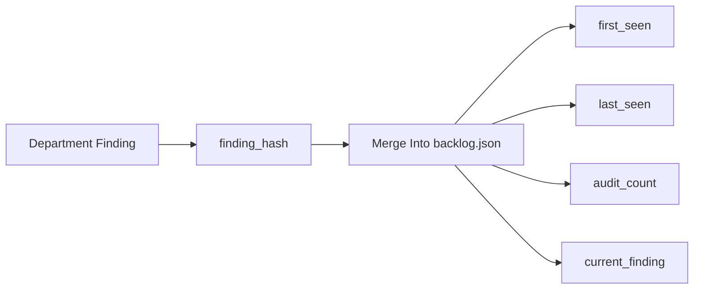

Backlog responsibilities:

- normalize finding shape
- deduplicate recurring findings
- preserve recurrence history
- keep the current finding payload available for detail views

This is why the dashboard can show more than “today’s list of problems.” It can show whether an issue is chronic, recent, or isolated.

### 5. Queue Layer

The queue layer is where the platform becomes governable.

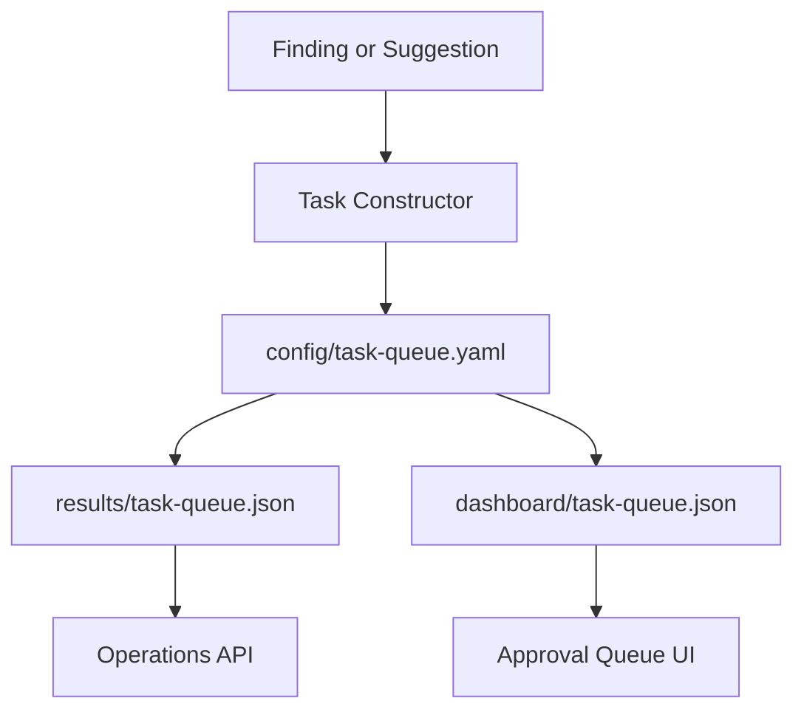

Queue responsibilities:

- create approval items from findings
- create approval items from product suggestions
- track status transitions
- preserve history entries for each transition
- group items by product key so counts stay isolated

The queue is intentionally explicit rather than inferred. A finding is not considered approved work until someone queues and approves it.

Task queue persistence writes to three places:

- `config/task-queue.yaml`
- `results/task-queue.json`
- `dashboard/task-queue.json`

That split lets the queue be:

- editable and versionable as YAML
- consumable by APIs as JSON
- renderable by the dashboard as static data

### 6. Dashboard Layer

The dashboard is a single-page control plane.

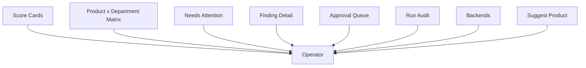

The dashboard combines:

- portfolio-level health
- finding-level evidence
- queue-level action
- backend visibility
- audit execution controls

This is what makes Back Office useful as an observability tool rather than just an automation script wrapper.

The local server currently serves both static assets and JSON APIs. Operator-facing routes in `backoffice/server.py` include:

- `GET /api/ops/status`
- `GET /api/ops/backends`
- `GET /api/tasks`
- `POST /api/run-scan`
- `POST /api/run-all`
- `POST /api/run-regression`
- `POST /api/manual-item`
- `POST /api/ops/audit`
- `POST /api/tasks/queue-finding`
- `POST /api/tasks/approve`
- `POST /api/tasks/cancel`
- `POST /api/tasks/request-pr`
- `POST /api/ops/product/suggest`
- `POST /api/ops/product/approve`

### 7. Delivery Layer

The delivery layer publishes static assets while keeping AWS cost behavior bounded.

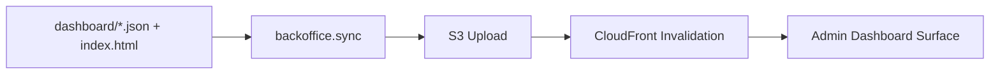

Important delivery property:

- CloudFront invalidation is bounded to wildcard behavior rather than unbounded path lists.

That rule is critical because Back Office is both an engineering surface and an operational tool. A dashboard is not useful if it quietly creates cost incidents.

---

## Finding Lifecycle

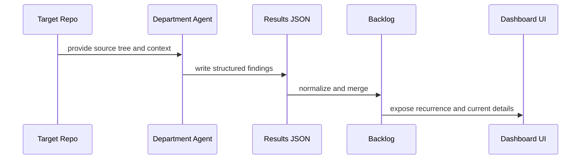

Key lifecycle properties:

- findings are structured, not freeform text blobs
- the backlog carries historical memory
- dashboard detail views can reference evidence and recurrence

---

## Approval Lifecycle

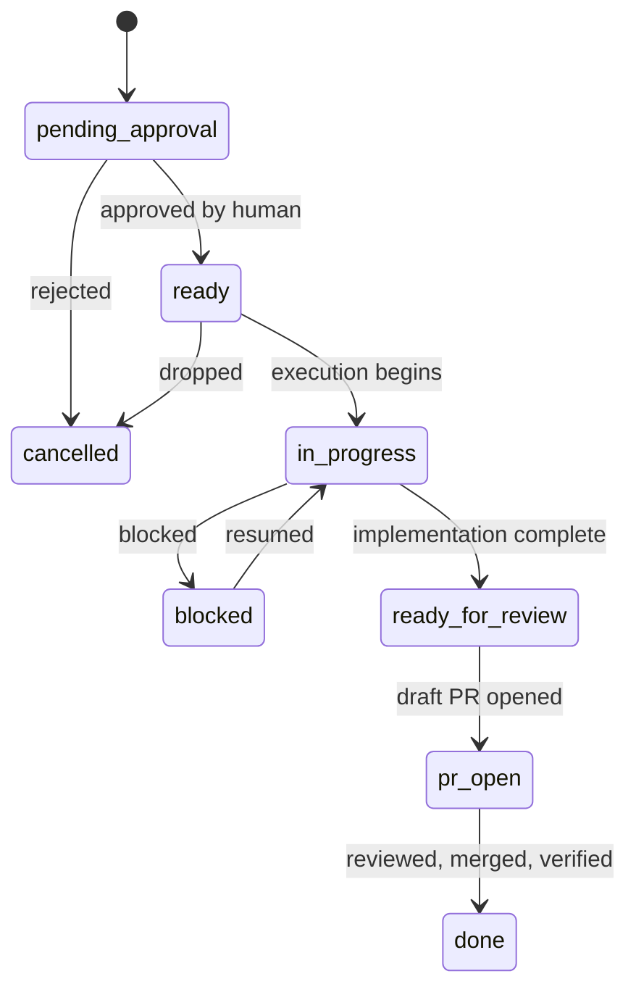

This lifecycle is represented in `backoffice/tasks.py` and surfaced in the dashboard.

It is intentionally shaped around control points:

- approval
- implementation
- review readiness
- GitHub review

---

## Product Suggestion Flow

Back Office also treats product onboarding as an approval workflow.

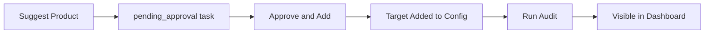

This prevents the control plane from silently expanding scope without review.

It also gives a useful demo story:

- product ideas are surfaced
- a person approves scope
- the platform records the decision
- the product then enters the same audit and visibility model as everything else

---

## GitHub Review Flow

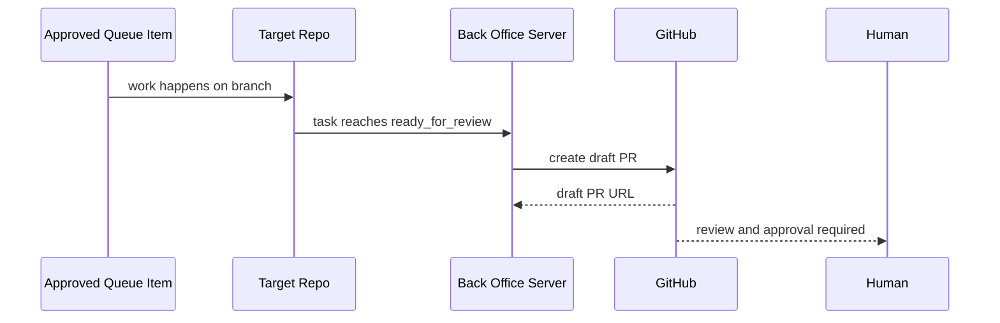

Important properties:

- PR creation is explicit
- PR creation refuses to operate from default branches
- GitHub remains the final review boundary

---

## Data Contracts

Important dashboard contracts:

| Contract | Produced by | Consumed by |
|---|---|---|
| `dashboard/qa-data.json` and peers | aggregation | dashboard UI |
| `dashboard/backlog.json` | backlog merge | finding detail and recurrence views |
| `dashboard/task-queue.json` | task queue sync | approval queue UI |
| `results/task-queue.json` | task queue sync | server responses and automation |
| `results/local-audit-log.json` | workflow | live job and audit history views |
| `results/.jobs.json` | job-status shell flow | live jobs UI |
| `results/.jobs-history.json` | job-status shell flow | recent run summaries |

Important queue fields:

- `status`
- `product_key`
- `task_type`
- `source_finding`
- `approval`
- `history`
- `target_path`
- `verification_command`
- `repo_handoff_path`

Important state surfaced from `ops/status`:

- running job map from `.jobs.json`
- recent job history from `.jobs-history.json`
- queue summary from `results/task-queue.json`
- backend health and limits from backend adapters
- configured targets from `backoffice.yaml`

These fields exist so the queue can support:

- per-product visibility
- decision traceability
- repo targeting
- review and verification behavior

---

## Operational Characteristics

Back Office is optimized for:

- **small, explicit context windows**
- **structured JSON artifacts over ad hoc text**
- **human review over hidden mutation**
- **portfolio visibility over repo-local tunnel vision**
- **bounded AWS publish behavior**

It is not optimized for:

- silent autonomous repo mutation as the default mode
- hidden prioritization logic
- opaque merge behavior
- undocumented delivery side effects

---

## Relevant Files

Core runtime:

- `backoffice/__main__.py`
- `backoffice/workflow.py`
- `backoffice/aggregate.py`
- `backoffice/backlog.py`
- `backoffice/tasks.py`
- `backoffice/server.py`
- `Makefile`

Core UI and artifacts:

- `dashboard/index.html`
- `dashboard/backlog.json`
- `dashboard/task-queue.json`
- `dashboard/score-history.json`

Delivery and controls:

- `backoffice/sync/engine.py`
- `backoffice/sync/providers/aws.py`
- `docs/COST_GUARDRAILS.md`

GitHub-facing docs:

- `README.md`
- `docs/WORKFLOW-ARCHITECTURE.md`
- `docs/CICD-REFERENCE.md`
