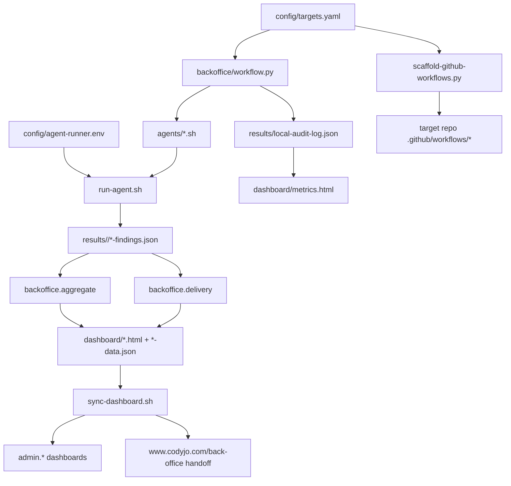
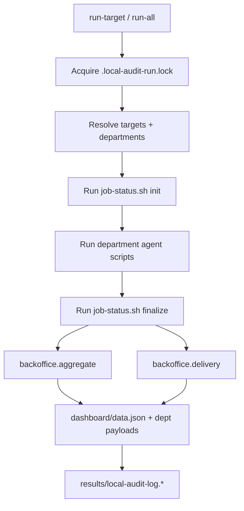
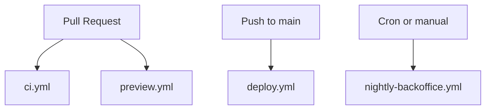

# Back Office Workflow Architecture

Back Office is the control plane for Cody Jo Method's product operations. It does four jobs:

1. Defines which repos exist and how they should be audited.
2. Runs department-specific audit agents across those repos.
3. Aggregates results into static dashboards and delivery metadata.
4. Publishes those dashboards to the protected admin surfaces and public handoff pages.

## System Topology

## What Each Layer Owns

### `config/targets.yaml`

This is the source of truth for local audit targets.

Each target can define:

- repo name
- absolute path
- language/runtime
- default departments
- lint, test, build, preview, deploy, and nightly command metadata
- product context for prompts and dashboard grouping

### `config/agent-runner.env`

This is the local persisted runner choice for Back Office.

It defines:

- `BACK_OFFICE_AGENT_RUNNER`
- `BACK_OFFICE_AGENT_MODE`

Use the CLI to manage it:

- `python -m backoffice runners`
- `python -m backoffice activate-runner --runner codex --mode stdin-text`

### `backoffice/workflow.py`

This is the reproducible local orchestration layer.

Important path behavior:

- script paths resolve from the Back Office repo itself
- config, results, dashboard, and task-queue payload roots can be redirected with `BACK_OFFICE_ROOT`
- `refresh` passes the redirected paths through to delivery metadata generation and task-queue sync so temp-root and test runs do not mutate the live repo outputs

It supports four real commands:

- `list-targets`
- `refresh`
- `run-target`
- `run-all`

The CLI maps `audit-all` directly to `run-all`, so the exact command for all configured targets is:

- `python -m backoffice audit-all`

Operationally it does this:

### `agents/*.sh`

Each department is explicit and separate.

Current local departments:

- `qa`
- `seo`
- `ada`
- `compliance`
- `monetization`
- `product`

This separation matters because Back Office is built around accountable lanes, not a single vague super-prompt.

### `backoffice.aggregate`

This transforms raw findings into dashboard-ready payloads.

Outputs include:

- `dashboard/data.json`
- `dashboard/qa-data.json`
- `dashboard/seo-data.json`
- `dashboard/ada-data.json`
- `dashboard/compliance-data.json`
- `dashboard/monetization-data.json`
- `dashboard/product-data.json`
- `dashboard/automation-data.json`
- `dashboard/local-audit-log.json`

### `dashboard/metrics.html`

This is the aggregate metrics surface for:

- code-quality findings across departments
- fixable-by-agent backlog
- recent agent runner usage
- target health from the local audit log
- delivery readiness from `automation-data.json`

### `backoffice.delivery`

This inspects target repos and records delivery posture.

It is what powers reporting on:

- CI workflow coverage
- preview workflow coverage
- production deploy coverage
- nightly automation coverage
- delivery readiness

### `scripts/sync-dashboard.sh`

This is the Back Office publisher.

It uploads static dashboard assets to configured targets and invalidates CloudFront.

Current security posture:

- `admin.*` targets are the intended published dashboards
- non-admin public targets are skipped unless they explicitly set `allow_public_read: true`

## GitHub Workflow Model

Back Office itself has four workflow classes:

Those workflows mean:

- `ci.yml` validates non-main pushes and PRs.
- `preview.yml` produces dashboard artifacts for review.
- `deploy.yml` validates first, then publishes dashboards.
- `nightly-backoffice.yml` refreshes delivery metadata and publishes nightly artifacts.

## Target Repo Workflow Model

Back Office scaffolds four workflow types into product repos:

- CI
- preview
- CD
- nightly

These are generated from `templates/github-actions/` and then committed in the target repo.

Back Office does not own production by hiding it. It owns the starting standard and the reporting surface.

## Documentation Surfaces

GitHub-facing docs live here:

- [`README.md`](../README.md)
- [`docs/WORKFLOW-ARCHITECTURE.md`](./WORKFLOW-ARCHITECTURE.md)
- [`docs/CICD-REFERENCE.md`](./CICD-REFERENCE.md)
- [`docs/LIVE-URLS.md`](./LIVE-URLS.md)

Published docs surfaces live in the dashboard:

- `dashboard/documentation.html`
- `dashboard/documentation-github.html`
- `dashboard/documentation-cicd.html`
- `dashboard/documentation-cli.html`
- `dashboard/metrics.html`
